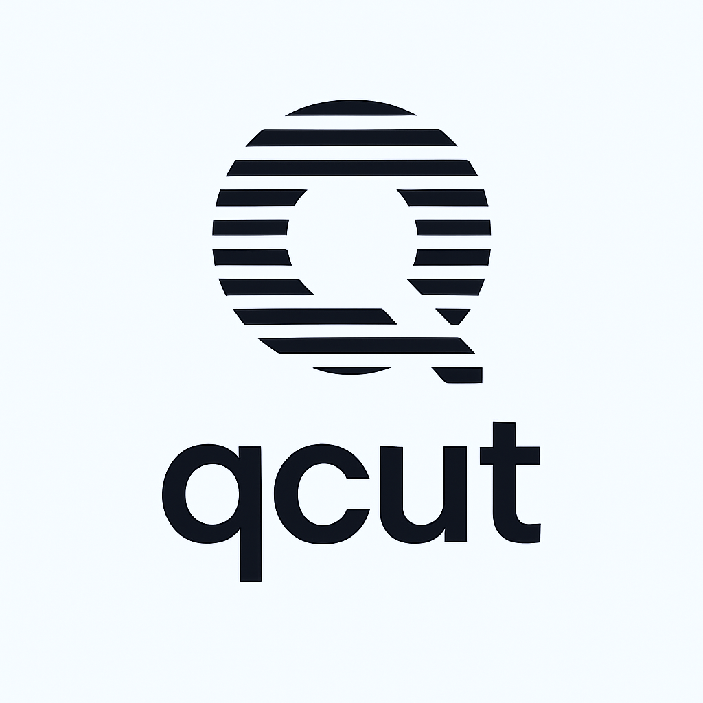

<table width="100%">
  <tr>
    <td align="left" width="120">
      
    </td>
    <td align="right">
      <h1>QCut <span style="font-size: 0.7em; font-weight: normal;">(prev AppCut)</span></h1>
      <h3 style="margin-top: -10px;">A free, open-source video editor for Windows desktop (and web).</h3>
    </td>
  </tr>
</table>

## Why?

- **Privacy**: Your videos stay on your device
- **Free features**: Every basic feature of CapCut is paywalled now
- **Simple**: People want editors that are easy to use - CapCut proved that

## Features

- **Native Windows Desktop App** - Runs completely offline with native file access
- **Timeline-based editing** - Professional video editing interface
- **Multi-track support** - Audio and video tracks with drag-and-drop
- **Real-time preview** - Instant feedback while editing
- **FFmpeg Integration** - Professional-grade video processing via WebAssembly
- **Local File System** - Native file dialogs and direct file access
- **No watermarks or subscriptions** - Completely free forever
- **Privacy-first** - All processing happens locally on your device

## Project Structure

- `apps/web/` – Main Vite + React application (migrated from Next.js)
- `electron/` – Electron main process and preload scripts
- `src/components/` – UI and editor components
- `src/hooks/` – Custom React hooks including Electron integration
- `src/lib/` – Utility and API logic including FFmpeg
- `src/stores/` – State management (Zustand, etc.)
- `src/types/` – TypeScript types including Electron APIs
- `src/routes/` – TanStack Router file-based routing

## Getting Started

### Prerequisites

Before you begin, ensure you have the following installed on your system:

- [Node.js](https://nodejs.org/en/) (v18 or later)
- [Bun](https://bun.sh/docs/installation) - Package manager and bundler
- [Git](https://git-scm.com/) - For cloning the repository

> **Note:** The Windows desktop app runs completely offline and doesn't require Docker, databases, or external services. Just Node.js and Bun are sufficient for building and running the Electron application.

### Quick Start (Windows Desktop App)

1. **Clone the repository:**
   ```bash
   git clone https://github.com/OpenCut-app/OpenCut.git
   cd QCut
   ```

2. **Install dependencies:**
   ```bash
   bun install
   ```

3. **Build the Vite application:**
   ```bash
   cd apps/web
   bun run build
   ```

4. **Run the Electron desktop app:**
   ```bash
   cd ../..  # Back to project root
   bun run electron
   ```

   **Or use this single command to build and run:**
   ```bash
   cd "apps/web" && bun run build && cd .. && npx electron .
   ```

The QCut desktop application will launch with the complete video editing interface!

## Development Setup

### Desktop App Development

For developing the Electron desktop application:

1. **Start the Vite development server:**
   ```bash
   cd apps/web
   bun run dev
   ```
   The dev server will start at `http://localhost:5174`

2. **In another terminal, run Electron in development mode:**
   ```bash
   cd ..  # Back to project root
   NODE_ENV=development bun run electron
   ```

This will launch Electron with hot reload capabilities for development.

### Available Scripts

From the project root:
- `bun run electron` - Run the Electron app in production mode
- `NODE_ENV=development bun run electron` - Run Electron in development mode

From `apps/web/`:
- `bun run dev` - Start Vite development server
- `bun run build` - Build the production bundle
- `bun run preview` - Preview the production build

### Building for Distribution

To create a Windows installer:

```bash
# Build the web app
cd apps/web
bun run build

# Return to root and build Windows installer
cd ../..
bun run dist:win
```

> **Note:** The installer will be created in the `dist-electron/` directory.

## Architecture

QCut uses a modern desktop application stack:

- **Frontend**: Vite + React + TanStack Router
- **Desktop**: Electron with secure IPC communication
- **Video Processing**: FFmpeg via WebAssembly
- **Styling**: Tailwind CSS with dark theme
- **State Management**: Zustand stores
- **File System**: Native Electron file dialogs and operations

## Contributing

We welcome contributions! The project has been successfully migrated to a desktop-first architecture.

**🎯 Current focus areas:** 
- Timeline functionality and performance
- Native desktop features (menus, shortcuts, file associations)
- Video processing optimizations
- UI/UX improvements for desktop workflow

**✅ Completed:**
- ✅ Full migration from Next.js to Vite + Electron
- ✅ Native file system integration
- ✅ TanStack Router implementation
- ✅ FFmpeg WebAssembly integration
- ✅ Production-ready Windows desktop build

**Quick start for contributors:**

- Fork the repo and clone locally
- Follow the Quick Start instructions above
- Create a feature branch and submit a PR

## Technical Notes

### Migration from Next.js to Electron

This project was successfully migrated from a Next.js web application to a native Windows desktop application using:

- **Vite** for fast bundling and development
- **TanStack Router** for file-based routing
- **Electron** for native desktop capabilities

Key improvements in the desktop version:
- Faster startup and build times
- Native file system access
- Offline operation
- Better performance for video processing
- No server dependencies

### Sponsors

Thanks to [Vercel](https://vercel.com?utm_source=github-opencut&utm_campaign=oss) for their support of open-source software.

<a href="https://vercel.com/oss">
  
</a>

## License

[MIT LICENSE](LICENSE)
