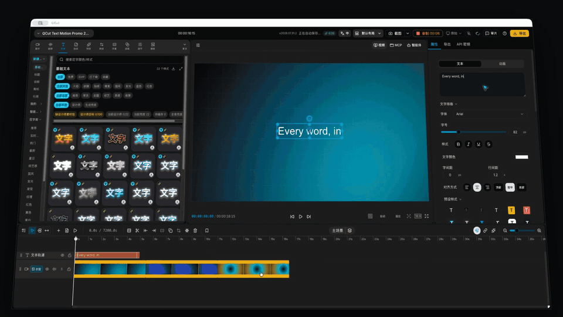
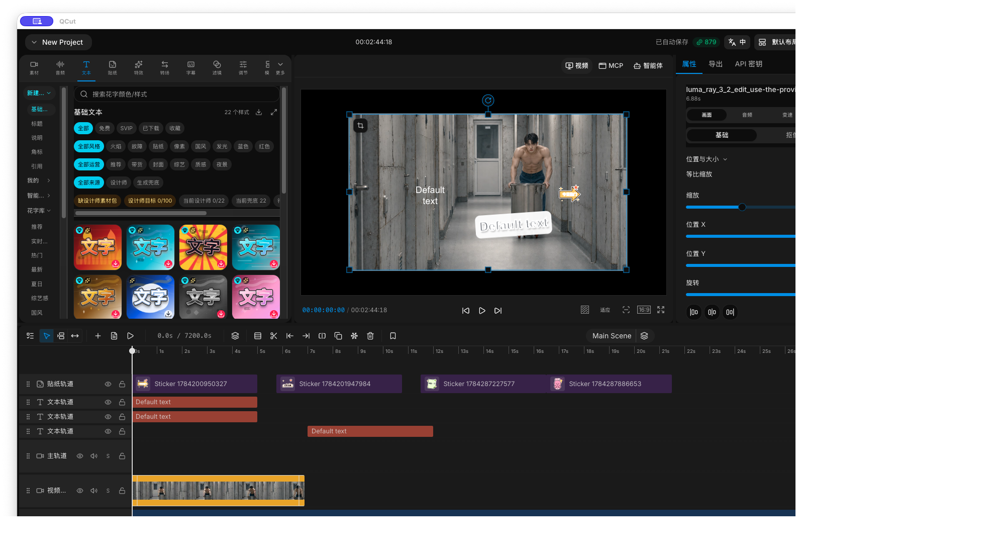
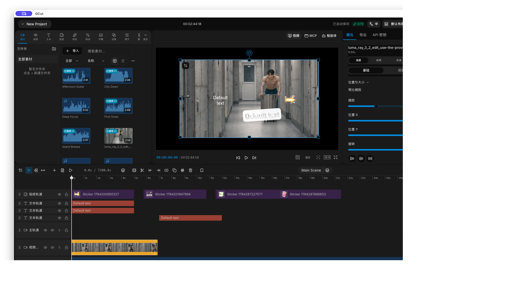
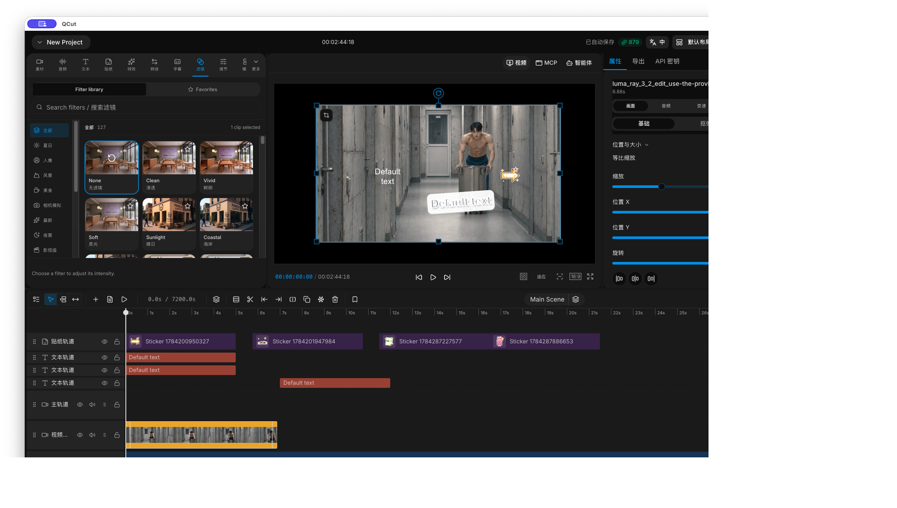
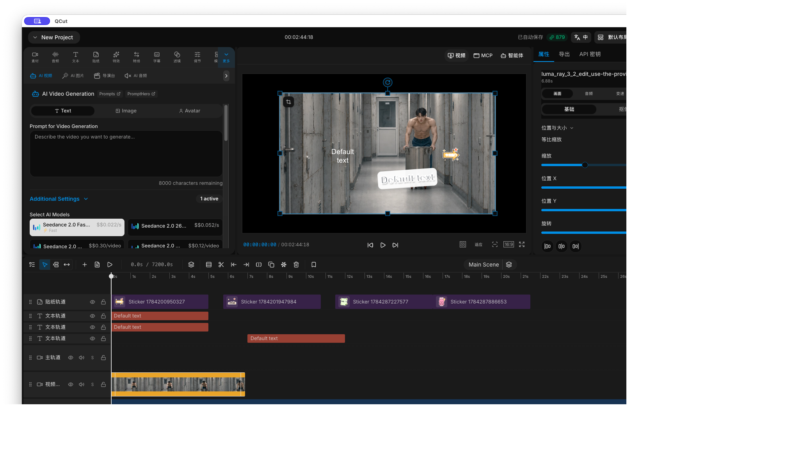

<div align="center">
  
  <h1>QCut</h1>
  <p><strong>Open-source desktop video editing for people and AI agents.</strong></p>
  <p>Edit on a multitrack timeline, generate media, or let Codex and Claude Code control QCut through its structured CLI.</p>

  <p>
    <a href="https://github.com/Quriosity-agent/qcut/releases/latest"><strong>Download QCut</strong></a>
    ·
    <a href="https://www.youtube.com/watch?v=H6rH5Z9HrH8">Watch the demo</a>
    ·
    <a href="#agent-plugins">Agent plugins</a>
    ·
    <a href="#build-from-source">Build from source</a>
  </p>

  <p>
    <a href="https://github.com/Quriosity-agent/qcut/releases/latest"></a>
    <a href="qcut/LICENSE"></a>
    <a href="https://deepwiki.com/Quriosity-agent/qcut"></a>
  </p>
</div>

## Why QCut?

Most video editors are designed for either manual work or closed automation. QCut supports both.

- **Edit by hand:** Work in a familiar desktop editor with a live preview, multitrack timeline, text, audio, filters, stickers, transitions, and precise clip controls.
- **Create with AI:** Generate images, video, speech, music, and avatars with the provider you choose, then add the results directly to the timeline.
- **Automate with agents:** Use the official **QCut Codex Plugin** or **QCut Claude Code Plugin** to inspect projects, edit timelines, generate media, transcribe footage, and export video.
- **Own your workflow:** QCut is free and open source. Timeline editing and export run on your machine, while optional AI features clearly use the external provider you select.

## Download

Download the newest packaged build from the [latest QCut release](https://github.com/Quriosity-agent/qcut/releases/latest).

| Platform | Package |
| --- | --- |
| Windows x64 | `.exe` installer |
| macOS Apple Silicon | `.dmg` |
| Linux x64 | `.AppImage` or `.deb` |

QCut can also check for updates inside the desktop app or from the CLI:

```bash
qcut update --check
qcut update --yes
```

## Agent Plugins

QCut ships one agent toolkit with manifests for both **OpenAI Codex** and **Anthropic Claude Code**. Both integrations use the same QCut CLI and editor-control skills, so agent actions stay visible and reproducible.

### Codex Plugin

Install from the public repository:

```bash
codex plugin marketplace add Quriosity-agent/qcut
codex plugin add qcut@qcut
```

`codex plugin add` requires a recent Codex CLI (verified with 0.144.5). If the subcommand is missing, update the Codex CLI first.

Start a new Codex task after installation. Example requests:

```text
Open my QCut project, inspect the timeline, and add captions.
Generate three B-roll options and place the best one on the timeline.
Check for the latest QCut release and update the app after I confirm.
```

### Claude Code Plugin

Run these commands inside Claude Code:

```text
/plugin marketplace add Quriosity-agent/qcut
/plugin install qcut@qcut
/reload-plugins
```

The equivalent non-interactive commands are:

```bash
claude plugin marketplace add Quriosity-agent/qcut
claude plugin install qcut@qcut
```

Editor-control tasks require the QCut desktop app to be running. CLI-only generation, analysis, and transcription can run without an open editor. The plugin never bundles API credentials; configure optional provider keys through QCut settings or its interactive CLI setup.

See the [QCut plugin documentation](qcut/plugins/qcut/README.md) for setup, diagnostics, local development, privacy, and update behavior.

## Demo

<a href="https://www.youtube.com/watch?v=H6rH5Z9HrH8">
  
  <br />
  <strong>Watch QCut in action</strong>
</a>

## Product Tour

### Text animation

Build typewriter entrances, wave loops, rotating exits, and other editable text motion directly in the timeline.

<!-- showcase:text-animations:start -->


Full promo: [English · 2K60](https://github.com/Quriosity-agent/qcut/releases/download/v2026.08.01.1/QCut-Text-Motion-ShotCraft-EN-2K60.mp4) · [中文版 · 2K60](https://github.com/Quriosity-agent/qcut/releases/download/v2026.08.01.1/QCut-Text-Motion-ShotCraft-ZH-2K60.mp4)
<!-- showcase:text-animations:end -->

<!-- showcase:stickers:start -->
<!-- Reserved for the sticker-animation showcase. Swap content between these
     markers with the readme-showcase skill; keep everything outside intact. -->
<!-- showcase:stickers:end -->

### Multitrack editing

Arrange video, audio, text, captions, stickers, and effects on a professional timeline with live preview and precise clip controls.



<table width="100%">
  <tr>
    <td width="50%" valign="top">
      <h3>Media workspace</h3>
      <p>Organize video, audio, images, and reusable assets in one searchable workspace.</p>
      
    </td>
    <td width="50%" valign="top">
      <h3>Filter library</h3>
      <p>Preview looks across portrait, landscape, cinematic, vintage, and stylized collections.</p>
      
    </td>
  </tr>
</table>

### AI media generation

Generate video from text, images, or avatars, compare supported AI models, and add the result directly to your edit.



## Highlights

| Area | Capabilities |
| --- | --- |
| Editing | Multitrack timeline, trim and split, text, captions, stickers, filters, transitions, masks, speed controls, live preview |
| AI media | Text-to-image, text-to-video, image-to-video, speech, music, avatars, transcription, and media analysis |
| Automation | Structured QCut CLI, Codex Plugin, Claude Code Plugin, editor inspection and control, machine-readable output |
| Media workflow | Searchable media workspace, sound and sticker libraries, project organization, import and export |
| Desktop | Windows, macOS, and Linux builds with native file access and bundled FFmpeg processing |

## Privacy

QCut is local-first, not “every feature is offline.”

- Manual editing, project storage, timeline operations, and FFmpeg export run locally.
- Optional AI generation may upload the inputs you select to the configured provider. If you are signed in without your own provider key, those requests — including the media you select — are relayed through the QCut license server, which holds provider keys on behalf of authenticated users.
- AI provider keys are not bundled; bring your own or sign in. One exception: QCut ships a shared Freesound API key so sound-effect search works out of the box until you configure your own.
- Packaged builds check GitHub for updates at startup and then hourly.
- The agent plugins use QCut's structured CLI and visible editor state rather than a hidden cloud copy of your project.

## Build From Source

### Requirements

- [Bun](https://bun.sh/)
- Node.js 18 or newer
- Git

### Run the desktop app

```bash
git clone https://github.com/Quriosity-agent/qcut.git
cd qcut/qcut
bun install
bun run electron:dev
```

### Create distribution packages

```bash
bun run dist:win      # Windows installer
bun run dist:mac      # macOS DMG, run on macOS
bun run dist:linux    # Linux AppImage and deb
```

## Documentation

| Topic | Link |
| --- | --- |
| Build commands | [qcut/docs/technical/guides/build-commands.md](qcut/docs/technical/guides/build-commands.md) |
| Project structure | [qcut/docs/technical/architecture/source-code-structure.md](qcut/docs/technical/architecture/source-code-structure.md) |
| Media panels | [qcut/docs/technical/media-panel-reference.md](qcut/docs/technical/media-panel-reference.md) |
| AI features | [qcut/docs/technical/ai/](qcut/docs/technical/ai/) |
| Testing | [qcut/docs/technical/testing/](qcut/docs/technical/testing/) |
| All technical docs | [qcut/docs/technical/README.md](qcut/docs/technical/README.md) |

## Technology

- **Application:** Electron, TypeScript, React, Vite, and TanStack Router
- **Media:** Native and WebAssembly FFmpeg pipelines
- **UI:** Tailwind CSS and Radix UI
- **Repository:** Bun and Turborepo monorepo

## Contributing

Issues and pull requests are welcome. Build QCut from source, create a focused branch, include tests for behavioral changes, and explain the user-facing result in the PR.

## License

QCut is available under the [MIT License](qcut/LICENSE).
