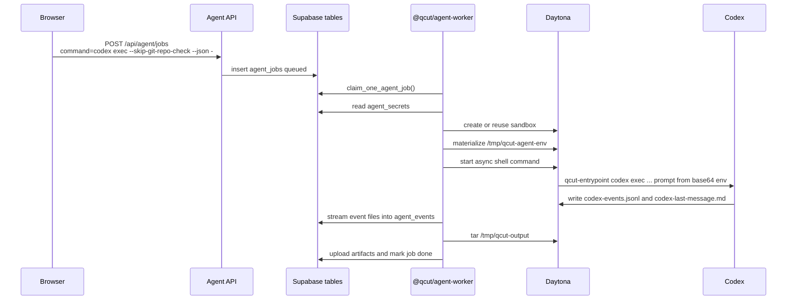
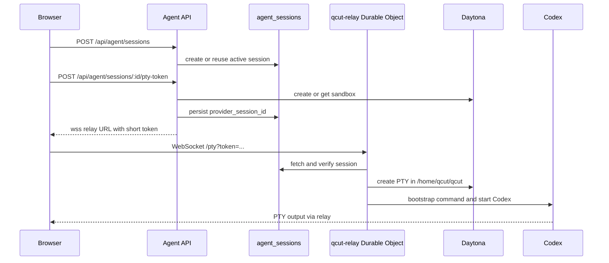
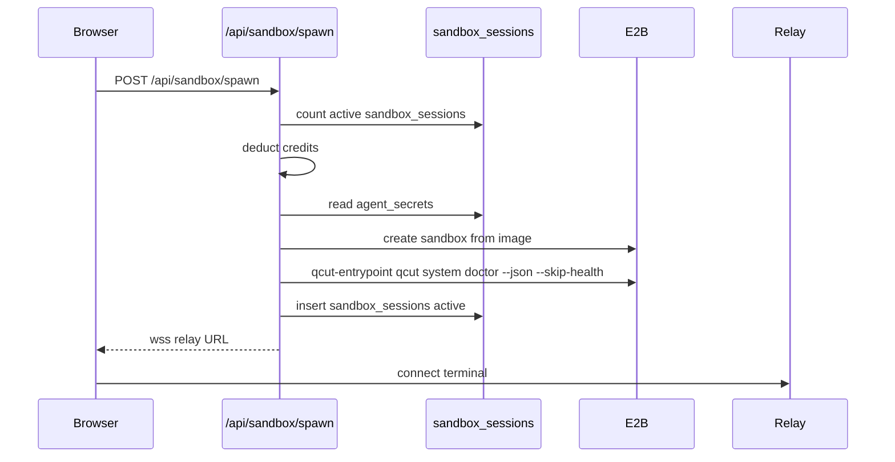

# Runtime Flows

This document traces the flows that matter when porting the sandbox design.

## Flow A: headless Codex job on Daytona

This is the best reference for "run Codex against a user prompt and collect files".

Important files:

- `packages/license-server/src/routes/agent-parts/jobs.ts`
- `packages/license-server/src/routes/agent-parts/validation.ts`
- `packages/agent-worker/src/run-on-daytona.ts`
- `packages/agent-worker/src/daytona/command.ts`
- `packages/agent-worker/src/daytona/streaming.ts`
- `packages/agent-worker/src/upload-artifacts.ts`

Important constraints:

- Job commands must start with `qcut ` or equal `codex exec --skip-git-repo-check --json -`.
- Tokens are validated against conservative regexes before shell construction.
- Codex prompt text is passed as base64 through `QCUT_CODEX_PROMPT_B64`.
- Final user files belong in `/tmp/qcut-output`.
- Temporary tools and caches belong in `/tmp/qcut-tools` or `/tmp`.

## Flow B: interactive Codex terminal on Daytona

This is the best reference for "let the user interact with Codex directly in a browser terminal".

Important files:

- `packages/license-server/src/routes/agent-parts/sessions.ts`
- `packages/license-server/src/routes/agent-parts/terminal.ts`
- `packages/license-server/src/routes/agent-parts/daytona.ts`
- `packages/qcut-relay/src/index.ts`
- `packages/qcut-relay/src/pty-session.ts`
- `packages/qcut-relay/src/verify-token.ts`
- `packages/qcut-relay/src/audit.ts`

Important constraints:

- Token is short-lived and signed by the API with `RELAY_SIGNING_SECRET`.
- Relay verifies the token again inside the Durable Object.
- Durable Object has a single-attachment guard to prevent two browser tabs racing the same PTY.
- `CODEX_HOME` is session-specific under `/home/qcut/.qcut-codex-home/...`.
- The relay starts Codex after calling `/usr/local/bin/qcut-entrypoint /bin/true` so env/auth files exist first.

## Flow C: older E2B browser sandbox

This path still exists as `/api/sandbox/spawn` in `packages/license-server/src/routes/sandbox.ts`. It is useful as a comparison, but it is not the cleanest target for WZRD if Daytona is the desired provider.

Keep from this path:

- Per-user concurrency cap.
- Credit charge before expensive spawn.
- Spawn doctor probe.
- Short relay token.

Do not copy blindly:

- E2B-specific SDK calls if the target is Daytona.
- `sandbox_sessions` table if the target is the newer `agent_sessions` flow.

## File movement model

QCut uses three remote directories consistently:

- `/tmp/qcut-input`: user uploads and reference files.
- `/tmp/qcut-output`: final files, small summaries, logs, and anything the UI should list/download.
- `/tmp/qcut-tools`: temporary installs, package caches, helper scripts, and scratch tools.

The API validates paths before exposing file browser operations:

- File names cannot include `/`, `\`, null bytes, `.`, or `..`.
- Sandbox paths must be absolute Unix paths with no `.` or `..` segments.
- Uploads are capped by `MAX_SESSION_UPLOAD_BYTES`.
- File/folder downloads go through normalized paths and optional tar creation for directories.

This directory contract is one of the best pieces to reuse in WZRD.

