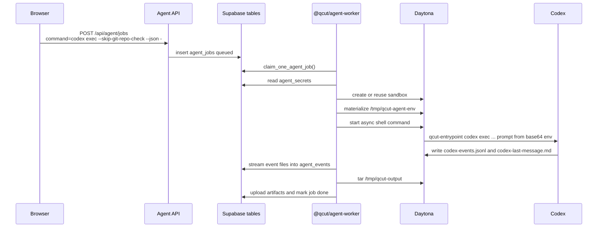
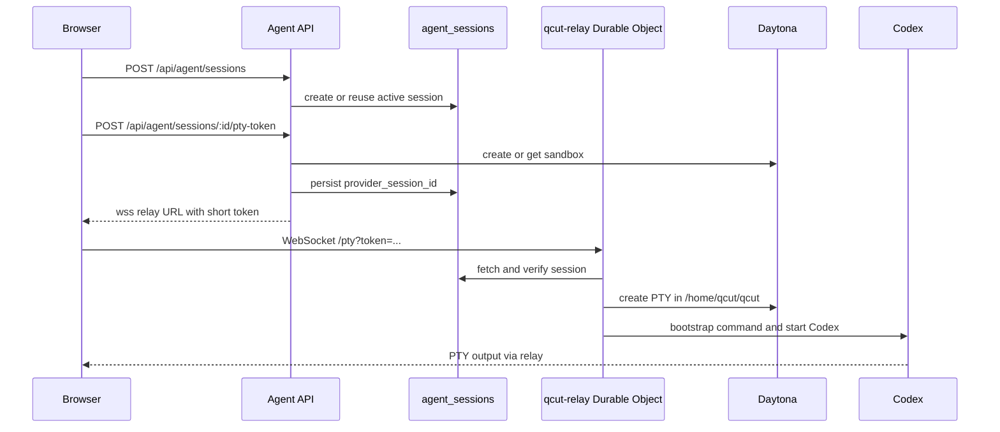
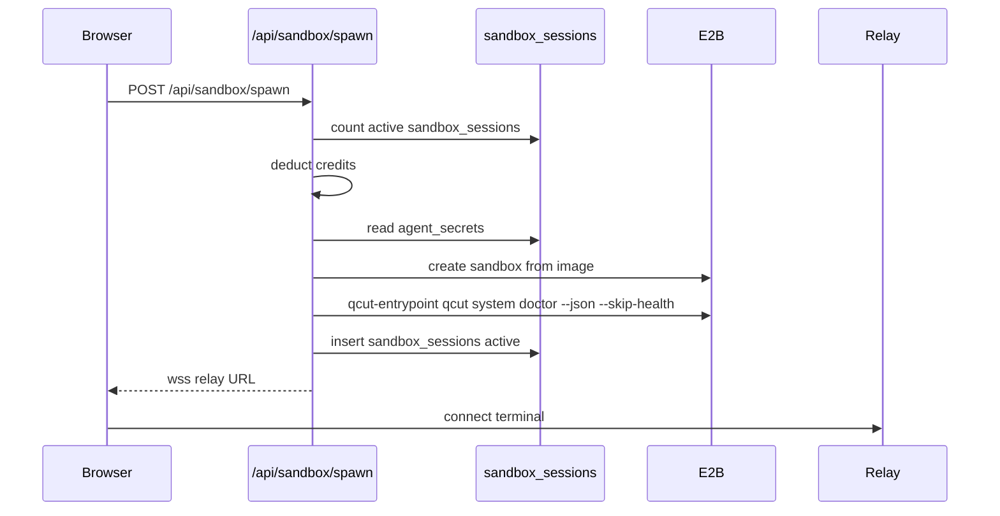

# 运行流程

本文追踪移植沙箱设计时最重要的运行链路。

## Flow A：Daytona 上的无头 Codex job

这是“针对用户 prompt 运行 Codex 并收集文件”的最佳参考。

重要文件：

- `packages/license-server/src/routes/agent-parts/jobs.ts`
- `packages/license-server/src/routes/agent-parts/validation.ts`
- `packages/agent-worker/src/run-on-daytona.ts`
- `packages/agent-worker/src/daytona/command.ts`
- `packages/agent-worker/src/daytona/streaming.ts`
- `packages/agent-worker/src/upload-artifacts.ts`

重要约束：

- job command 必须以 `qcut ` 开头，或严格等于 `codex exec --skip-git-repo-check --json -`。
- token 会先经过保守 regex 校验，再参与 shell command 构造。
- Codex prompt 通过 `QCUT_CODEX_PROMPT_B64` 以 base64 env 传入。
- 最终用户文件写入 `/tmp/qcut-output`。
- 临时工具和 cache 写入 `/tmp/qcut-tools` 或 `/tmp`。

## Flow B：Daytona 上的交互式 Codex terminal

这是“让用户在浏览器 terminal 中直接和 Codex 交互”的最佳参考。

重要文件：

- `packages/license-server/src/routes/agent-parts/sessions.ts`
- `packages/license-server/src/routes/agent-parts/terminal.ts`
- `packages/license-server/src/routes/agent-parts/daytona.ts`
- `packages/qcut-relay/src/index.ts`
- `packages/qcut-relay/src/pty-session.ts`
- `packages/qcut-relay/src/verify-token.ts`
- `packages/qcut-relay/src/audit.ts`

重要约束：

- token 由 API 用 `RELAY_SIGNING_SECRET` 签名，且有效期很短。
- relay 在 Durable Object 内再次验证 token。
- Durable Object 有 single-attachment guard，防止两个浏览器 tab 争用同一个 PTY。
- `CODEX_HOME` 按 session 隔离，路径位于 `/home/qcut/.qcut-codex-home/...`。
- relay 会先调用 `/usr/local/bin/qcut-entrypoint /bin/true`，确保 env/auth 文件存在，再启动 Codex。

## Flow C：旧 E2B browser sandbox

这条链路仍存在于 `packages/license-server/src/routes/sandbox.ts` 的 `/api/sandbox/spawn`。它适合作为对照，但如果目标 provider 是 Daytona，它不是最干净的 WZRD 移植目标。

值得保留的思路：

- 每用户并发上限。
- 在昂贵 spawn 前扣除 credits。
- spawn 后做 doctor probe。
- 使用短期 relay token。

不要盲目复制：

- 如果目标是 Daytona，不要复制 E2B-specific SDK 调用。
- 如果目标是新的 `agent_sessions` flow，不要复用 `sandbox_sessions` 表。

## 文件流转模型

QCut 稳定使用三个远程目录：

- `/tmp/qcut-input`：用户上传和 reference 文件。
- `/tmp/qcut-output`：最终文件、小型 summary/log，以及 UI 应该列出或下载的内容。
- `/tmp/qcut-tools`：临时安装、package cache、helper script、scratch tools。

API 在暴露 file browser 操作前会校验路径：

- 文件名不能包含 `/`、`\`、null byte、`.` 或 `..`。
- sandbox path 必须是绝对 Unix 路径，不能包含 `.` 或 `..` 段。
- 上传受 `MAX_SESSION_UPLOAD_BYTES` 限制。
- 文件/文件夹下载使用 normalize 后的路径，目录下载会先创建 tar。

这个目录合约是最值得复用到 WZRD 的部分之一。

