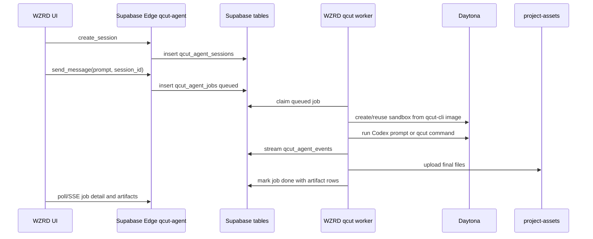

# WZRD Implementation Plan

This plan adapts QCut's current sandbox architecture to `wzrdagentstudio`, whose app already uses Vite, React, Supabase Edge Functions, Supabase Storage, and wallet-auth session bridging.

The main correction to the older `wzrdagentstudio/docs/plans/qcut-agent.md` plan is: do not clone and build QCut inside every sandbox for the real implementation. QCut now has a prebuilt `qcut-cli` image pattern. Use that image or a WZRD-specific derivative image.

## Recommended v1

Build a headless agent first, then add an interactive terminal later.

V1 shape:

- React page: `/qcut-agent` or a panel inside the existing studio.
- Supabase tables: `qcut_agent_sessions`, `qcut_agent_jobs`, `qcut_agent_events`, `qcut_agent_artifacts`.
- Supabase Edge Function: `qcut-agent`.
- External worker: a small long-running worker similar to `@qcut/agent-worker`, because Supabase Edge Functions are not a good home for long-running sandbox execution.
- Provider: Daytona.
- Runtime image: QCut `qcut-cli` image or WZRD derivative.
- Storage: existing WZRD `project-assets` bucket for final media.

The browser should never receive `DAYTONA_API_KEY`, provider keys, relay signing secrets, or service-role database credentials.

## V1 flow

For the first slice, polling job detail is simpler than a live PTY. Add SSE if the current Supabase setup supports reliable streaming in your deployment. Add the Cloudflare Durable Object relay only when browser terminal interactivity is required.

## Tables

Use WZRD-specific table names, but copy the QCut relationships:

- `qcut_agent_sessions`
  - `id`
  - `user_id`
  - `status`
  - `provider`
  - `provider_session_id`
  - `image_tag`
  - `started_at`
  - `last_active_at`
  - `expires_at`
  - `ended_at`
  - `end_reason`
- `qcut_agent_jobs`
  - `id`
  - `user_id`
  - `session_id`
  - `status`
  - `command`
  - `args`
  - `created_at`
  - `claimed_at`
  - `finished_at`
  - `exit_code`
  - `error`
  - `runner_id`
- `qcut_agent_events`
  - `id`
  - `job_id`
  - `session_id`
  - `user_id`
  - `kind`
  - `payload`
  - `created_at`
- `qcut_agent_artifacts`
  - `id`
  - `job_id`
  - `session_id`
  - `user_id`
  - `kind`
  - `storage_path`
  - `bytes`
  - `meta`
  - `created_at`

Because the WZRD agent guide forbids direct client or edge-function queries against `auth.users`, use the existing wallet-auth session bridge to determine the current user and store that application user id. Keep RLS policies based on session ownership, not raw `auth.users` access from application code.

## Edge Function responsibilities

The `qcut-agent` Edge Function should be thin:

- Authenticate the user through the existing WZRD Supabase session bridge.
- Create/reuse sessions.
- Insert jobs.
- Return job detail, events, and artifact metadata.
- Generate signed upload/download URLs if needed.
- Validate commands and prompt size.
- Never run arbitrary shell directly in the Edge Function.

Avoid copying QCut's Cloudflare/Hono license server directly into a Supabase Edge Function. Copy the route behavior and validation rules, then rewrite them in Deno style.

## Worker responsibilities

The worker should own long-running work:

- Claim one queued job atomically.
- Read the user's allowed provider secrets from the WZRD secrets surface.
- Create or reuse the Daytona sandbox.
- Materialize env files in the sandbox.
- Run Codex or QCut CLI command.
- Stream progress into event rows.
- Copy `/tmp/qcut-output` artifacts into `project-assets/{userId}/qcut-agent/{sessionId}/...`.
- Mark the job terminal.
- Clean idle sessions.

If WZRD does not yet have a general worker deployment target, run the worker as a small Bun service first. That matches QCut's `packages/agent-worker` design more closely than trying to keep everything inside Edge Functions.

## Runtime image

Use the QCut image pattern:

- Keep the QCut CLI preinstalled.
- Keep Codex CLI preinstalled.
- Keep FFmpeg and media tools preinstalled.
- Keep native CLI skill docs copied into the image.
- Start from an immutable digest in production.

WZRD-specific changes:

- Add WZRD prompt/instructions instead of appending QCut-specific wording only.
- Add WZRD asset upload conventions to the Codex prompt.
- Add only the provider keys WZRD actually supports.
- Keep final media in `/tmp/qcut-output` so the worker has one artifact root.

## Interactive terminal later

If the product needs a browser terminal attached to live Codex, copy the QCut relay architecture:

- Cloudflare Worker + Durable Object for long-lived WebSocket.
- Short-lived HS256 token signed by the Supabase Edge Function or another backend.
- Durable Object verifies token and fetches session state.
- Daytona PTY runs Codex in the sandbox.
- Single-attachment guard.

Do not put a long-running WebSocket PTY inside a Supabase Edge Function.

