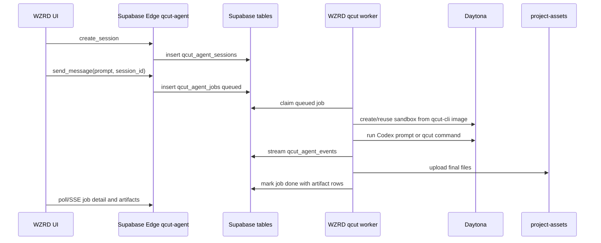

# WZRD 实施方案

这个方案把 QCut 当前的沙箱架构适配到 `wzrdagentstudio`。该应用已经使用 Vite、React、Supabase Edge Functions、Supabase Storage，以及 wallet-auth session bridge。

对旧的 `wzrdagentstudio/docs/plans/qcut-agent.md` 计划，一个关键修正是：真实实现不要在每个 sandbox 里 clone 并 build QCut。QCut 现在已经有预构建 `qcut-cli` 镜像模式。应该使用这个镜像，或构建一个 WZRD-specific derivative image。

## 推荐 v1

先做无头 agent，再补交互式 terminal。

V1 形态：

- React page：`/qcut-agent`，或现有 studio 内的一个 panel。
- Supabase tables：`qcut_agent_sessions`、`qcut_agent_jobs`、`qcut_agent_events`、`qcut_agent_artifacts`。
- Supabase Edge Function：`qcut-agent`。
- 外部 worker：类似 `@qcut/agent-worker` 的小型长运行 worker，因为 Supabase Edge Functions 不适合承载长时间 sandbox 执行。
- Provider：Daytona。
- Runtime image：QCut `qcut-cli` 镜像或 WZRD derivative image。
- Storage：使用现有 WZRD `project-assets` bucket 存最终媒体。

浏览器永远不应该拿到 `DAYTONA_API_KEY`、provider keys、relay signing secret 或 service-role database credentials。

## V1 流程

第一版用 polling 获取 job detail 比 live PTY 简单。如果当前 Supabase 部署能可靠支持 streaming，再加 SSE。只有在需要浏览器 terminal 交互时，才加入 Cloudflare Durable Object relay。

## 表结构

使用 WZRD-specific 表名，但复制 QCut 的关系模型：

- `qcut_agent_sessions`
  - `id`
  - `user_id`
  - `status`
  - `provider`
  - `provider_session_id`
  - `image_tag`
  - `started_at`
  - `last_active_at`
  - `expires_at`
  - `ended_at`
  - `end_reason`
- `qcut_agent_jobs`
  - `id`
  - `user_id`
  - `session_id`
  - `status`
  - `command`
  - `args`
  - `created_at`
  - `claimed_at`
  - `finished_at`
  - `exit_code`
  - `error`
  - `runner_id`
- `qcut_agent_events`
  - `id`
  - `job_id`
  - `session_id`
  - `user_id`
  - `kind`
  - `payload`
  - `created_at`
- `qcut_agent_artifacts`
  - `id`
  - `job_id`
  - `session_id`
  - `user_id`
  - `kind`
  - `storage_path`
  - `bytes`
  - `meta`
  - `created_at`

因为 WZRD agent guide 禁止 client 或 edge function 直接查询 `auth.users`，应使用现有 wallet-auth session bridge 来确定当前用户，并存储应用层 user id。RLS policy 应基于 session ownership，而不是让应用代码直接访问 `auth.users`。

## Edge Function 职责

`qcut-agent` Edge Function 应该保持很薄：

- 通过现有 WZRD Supabase session bridge 认证用户。
- 创建/复用 session。
- 插入 job。
- 返回 job detail、events 和 artifact metadata。
- 在需要时生成 signed upload/download URL。
- 校验 command 和 prompt size。
- 永远不要在 Edge Function 里直接运行任意 shell。

不要把 QCut 的 Cloudflare/Hono license server 直接复制进 Supabase Edge Function。应该复制路由行为和校验规则，然后用 Deno 风格重写。

## Worker 职责

长时间工作应该由 worker 承担：

- 原子领取一个 queued job。
- 从 WZRD secret surface 读取该用户允许的 provider secrets。
- 创建或复用 Daytona sandbox。
- 在 sandbox 中 materialize env files。
- 运行 Codex 或 QCut CLI command。
- 把进度写入 event rows。
- 把 `/tmp/qcut-output` artifacts 复制到 `project-assets/{userId}/qcut-agent/{sessionId}/...`。
- 把 job 标记为终态。
- 清理 idle sessions。

如果 WZRD 还没有通用 worker 部署目标，先把 worker 作为小型 Bun service 运行。这比试图把所有东西塞进 Edge Functions 更接近 QCut 的 `packages/agent-worker` 设计。

## Runtime image

使用 QCut 镜像模式：

- 预装 QCut CLI。
- 预装 Codex CLI。
- 预装 FFmpeg 和媒体工具。
- 把 native CLI skill docs 复制进镜像。
- 生产环境使用 immutable digest。

WZRD-specific 改动：

- 添加 WZRD prompt/instructions，而不是只追加 QCut-specific 文案。
- 把 WZRD asset upload 约定写入 Codex prompt。
- 只加入 WZRD 实际支持的 provider keys。
- 最终媒体仍写入 `/tmp/qcut-output`，让 worker 只有一个 artifact root。

## 后续交互式 terminal

如果产品需要浏览器 terminal 连接 live Codex，复制 QCut relay 架构：

- Cloudflare Worker + Durable Object 承载长连接 WebSocket。
- Supabase Edge Function 或其他 backend 签发短期 HS256 token。
- Durable Object 验证 token 并读取 session 状态。
- Daytona PTY 在 sandbox 中运行 Codex。
- single-attachment guard。

不要把长运行 WebSocket PTY 放进 Supabase Edge Function。

