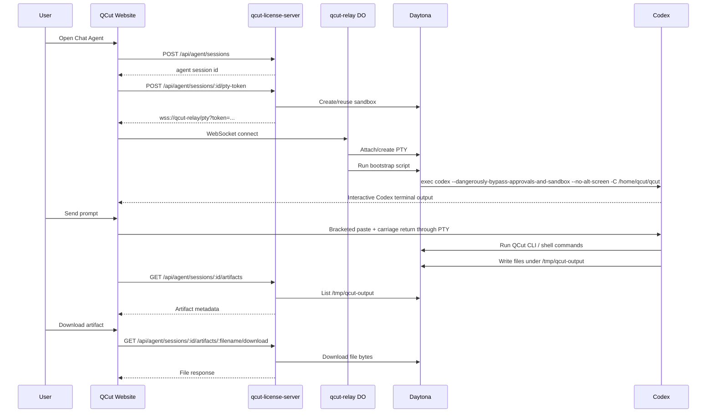

# 11 Chat Agent Runtime Flow

This document describes the current production flow after the `qcut-cli-v2`
merge and `v2026.05.16.1` release.

The important mental model:

> The Chat Agent page opens a browser terminal, but that terminal is not a
> normal shell for the user to configure. On connect, the relay automatically
> boots an already-authorized interactive Codex CLI inside the Daytona sandbox.

## User Flow

1. User opens `https://quriosity.com.au/chat-agent.html`.
2. The page creates or reuses an agent session through `qcut-license-server`.
3. The page asks `qcut-license-server` for a short-lived PTY WebSocket token.
4. The browser connects to `qcut-relay` over WebSocket.
5. `qcut-relay` attaches to a Daytona PTY for that session.
6. `qcut-relay` runs the bootstrap script inside the PTY.
7. The bootstrap script enters interactive Codex automatically.
8. The user sends prompts from the web page.
9. Prompts are pasted into the same long-lived Codex TUI.
10. Codex runs QCut CLI work inside the sandbox.
11. Files written to `/tmp/qcut-output` appear in the Artifacts panel.
12. The user downloads artifacts through the license-server download route.

## Component Map

| Component | Responsibility |
| --- | --- |
| `packages/nexusai-website/chat-agent.html` | User-facing Chat Agent page. |
| `packages/nexusai-website/js/agent-chat.js` | Creates sessions, connects WebSocket, renders terminal, sends prompts, polls artifacts. |
| `packages/license-server/src/routes/agent.ts` | Owns auth, session creation/reuse/end, PTY token issuing, artifact listing/download. |
| `packages/qcut-relay/src/pty-session.ts` | Cloudflare Durable Object that bridges browser WebSocket to Daytona PTY. |
| Daytona sandbox | Runs the QCut image and hosts the interactive Codex CLI. |
| Codex CLI | Long-lived agent process that receives the user prompts and runs commands. |
| `/tmp/qcut-output` | Contract directory for downloadable files. |

## Sequence



## What Connect Does

Connect does not simply expose a raw terminal.

After the WebSocket is attached, `qcut-relay` sends a startup script to the PTY.
That script:

1. Runs `/usr/local/bin/qcut-entrypoint /bin/true`.
2. Changes directory to `/home/qcut/qcut`.
3. Creates `/tmp/qcut-output` and `/tmp/qcut-tools`.
4. Writes `/home/qcut/qcut` as a trusted Codex project in
   `/home/qcut/.codex/config.toml`.
5. Appends QCut Chat Agent defaults to `/home/qcut/qcut/AGENTS.md`.
6. Temporarily disables PTY echo so bootstrap heredocs do not pollute terminal
   scrollback.
7. Starts Codex with:

```bash
codex --dangerously-bypass-approvals-and-sandbox --no-alt-screen -C /home/qcut/qcut
```

The user should land directly in an interactive Codex TUI. They should not need
to type `codex`, approve commands, or answer the workspace trust prompt.

## How Codex Knows QCut

The relay writes a QCut-specific section into the sandbox `AGENTS.md`. That
section tells Codex:

- It is QCut's website Chat Agent running inside a Daytona sandbox.
- It should prefer the native QCut CLI for QCut image/video work.
- The native CLI skill is at
  `/home/qcut/qcut/.claude/skills/native-cli/SKILL.md`.
- For nontrivial QCut workflows, it should read that skill before choosing
  commands.
- Final user-requested files must be written to `/tmp/qcut-output`.
- Temporary tools, caches, and package installs should go to `/tmp/qcut-tools`
  or `/tmp`, not `/tmp/qcut-output`.

This means the first visible user prompt is reserved for the real task. The
bootstrap instructions are context, not an extra live chat turn.

## How Web Prompts Enter Codex

The website no longer spawns a new `codex exec` process for each message.

Instead, `agent-chat.js` sends:

1. Bracketed paste start.
2. The sanitized user prompt.
3. Bracketed paste end.
4. Carriage return.

That makes the web Send button behave like a user pasting the prompt into the
already-open Codex TUI and pressing Enter.

Because the same Codex process remains open, follow-up prompts can use the same
conversation and the same sandbox filesystem.

## Session Lifetime

`qcut-license-server` stores the persistent session in `agent_sessions`.

Current behavior:

- A user gets the newest active session when possible.
- The Daytona sandbox is reused for that session.
- The New button ends the old session and creates a fresh one on next connect.
- Sessions have a hard expiry and can be cleaned up by the backend.

The practical effect is:

- Normal follow-up messages use the same Codex process while the PTY remains
  connected.
- Files and tools in the sandbox persist across turns.
- A new session gives the user a clean sandbox.

## Artifact Contract

Codex and QCut jobs must write final downloadable outputs to:

```bash
/tmp/qcut-output
```

The website polls:

```text
GET /api/agent/sessions/:sessionId/artifacts
```

The license-server lists `/tmp/qcut-output` using Daytona `fs.listFiles()` first.
If that returns no usable files, it falls back to a shell listing in the Daytona
process namespace.

Downloads go through:

```text
GET /api/agent/sessions/:sessionId/artifacts/:filename/download
```

The download route validates the filename and streams bytes from Daytona. This
keeps the browser from needing direct Daytona credentials.

## Security And Trust Boundaries

- The browser only receives a short-lived relay token.
- The relay verifies the token before opening the WebSocket.
- The relay token is scoped to one `agent_sessions.id`.
- The license-server scopes sessions and artifacts to the authenticated user or
  the configured default agent account.
- Codex runs with bypassed approvals because the sandbox isolation boundary is
  Daytona, not the local user machine.
- The trusted project entry is only for `/home/qcut/qcut` inside the sandbox.

## Current Production Verification

The flow was verified after deployment:

- A new Daytona session connected through deployed `qcut-relay`.
- Codex opened by default in YOLO mode.
- No workspace trust prompt appeared.
- Bootstrap setup did not leak the `AGENTS.md` heredoc into terminal scrollback.
- A prompt sent through the PTY made Codex create
  `/tmp/qcut-output/direct-1778919565593.txt`.
- The Artifacts API listed the file.
- The download endpoint returned matching content.

## Web Screenshot Verification - 2026-05-16

Playwright was run against production
`https://quriosity.com.au/chat-agent.html`.

Screenshot folders:

- `/Users/peter/Desktop/code/qcut/qcut/output/playwright/chat-agent-runtime-flow-1778959460163`
- `/Users/peter/Desktop/code/qcut/qcut/output/playwright/chat-agent-runtime-flow-success-1778959959684`

### Flow A: Requested Manual-Connect Expectation

Goal: verify that before pressing Connect the page does not enter Codex, then
press Connect and confirm Codex starts.

Result: partially failed.

| Step | Expected | Actual | Status | Screenshot |
| --- | --- | --- | --- | --- |
| Fresh load, no click, 400ms | Terminal idle / not connected | Status already `connecting`; terminal still showed fallback text | Pass for "not Codex yet", fail for "not connecting" | `01-initial-load-no-click-400ms.png` |
| Fresh load, no click, 8s | Still disconnected / no Codex | Status `connected`; terminal already showed OpenAI Codex in YOLO mode | Fail | `02-no-click-after-8s.png` |
| Codex readiness | Codex should be ready after connect | Codex was ready, but it happened by auto-connect, not user click | Pass for Codex boot, fail for manual trigger semantics | `03-codex-ready.png` |
| Click Disconnect | Terminal should disconnect | Status became `disconnected` | Pass | `04-after-disconnect-click.png` |
| Click Connect after disconnect | New live Codex connection should become connected | Terminal still showed old Codex content, but status later fell to `disconnected`; prompt sends became unreliable | Fail / flaky | `05-after-manual-connect-click-codex.png`, `06-turn-one-prompt-visible.png`, `07-turn-two-command-ran.png` |

Main finding:

- The current production page calls `autoConnectAgentTerminal()` during
  `initAgentChatPage()`. That means the user does not need to press Connect;
  the page starts connecting immediately after load.
- This contradicts the new expected manual flow where Connect is the explicit
  action that starts the sandbox/Codex.

Secondary finding:

- After clicking Disconnect, the terminal still contains stale Codex output.
  The test's first manual reconnect check could match old terminal text while
  the new socket was still `connecting`.
- Prompt submission after that reconnect became unreliable because the terminal
  status later changed to `disconnected`.

### Flow B: Current Auto-Connected Production Flow

Goal: verify the current deployed behavior without disconnecting.

Result: succeeded.

| Step | Expected | Actual | Status | Screenshot |
| --- | --- | --- | --- | --- |
| Fresh load, 500ms | Page has not yet shown Codex | Status was already `connecting`; fallback text still visible | Pass for "not Codex yet"; confirms auto-connect starts immediately | `01-load-500ms-before-user-click.png` |
| Wait for ready | Codex opens in the terminal | Status `connected`; OpenAI Codex shown in YOLO mode | Pass | `02-auto-connected-codex-ready.png` |
| Turn 1 | Prompt is sent into persistent Codex | Marker `WEB_SUCCESS_TURN_ONE_1778959959684` appeared in the terminal/chat flow | Pass | `03-turn-one-marker-visible.png` |
| Turn 2 | Codex runs a shell command creating an artifact | Terminal showed `Ran mkdir -p /tmp/qcut-output ... web-success-1778959959684.txt` | Pass | `04-turn-two-terminal-visible.png` |
| Artifacts | File appears in the web Artifacts panel | `web-success-1778959959684.txt`, 34 bytes, Download button visible | Pass | `05-artifact-panel-visible.png` |

This proves the current production path works when the page auto-connects and
the socket stays connected:

1. The page reaches interactive Codex.
2. The website Send button can submit prompts into that Codex session.
3. A follow-up prompt can run a command.
4. Files written under `/tmp/qcut-output` appear in Artifacts.

## Fix Plan For Manual Connect Semantics

If the intended UX is "nothing starts until the user presses Connect", the next
change should be:

1. Remove `autoConnectAgentTerminal()` from `initAgentChatPage()`.
2. Keep the Connect button as the only default path into
   `connectAgentTerminal()`.
3. Keep Send behavior as a convenience path, but make it visibly call
   `connectAgentTerminal()` only after the user presses Send.
4. Clear or reset terminal content on Disconnect/New Session so stale Codex text
   cannot be mistaken for a fresh connection.
5. Set `terminalSocket = null` in the WebSocket close handler.
6. Disable Send while terminal status is `connecting`.
7. In tests, wait for both status `connected` and a new-session marker, not just
   any old terminal text containing "OpenAI Codex".

## What This Is Not

This is not a queue-only job runner anymore for the website Chat Agent path.
The old one-shot `agent_jobs -> worker -> codex exec -> upload -> delete
sandbox` model still matters for headless jobs, but the website Chat Agent path
is now a persistent Daytona PTY running interactive Codex.
