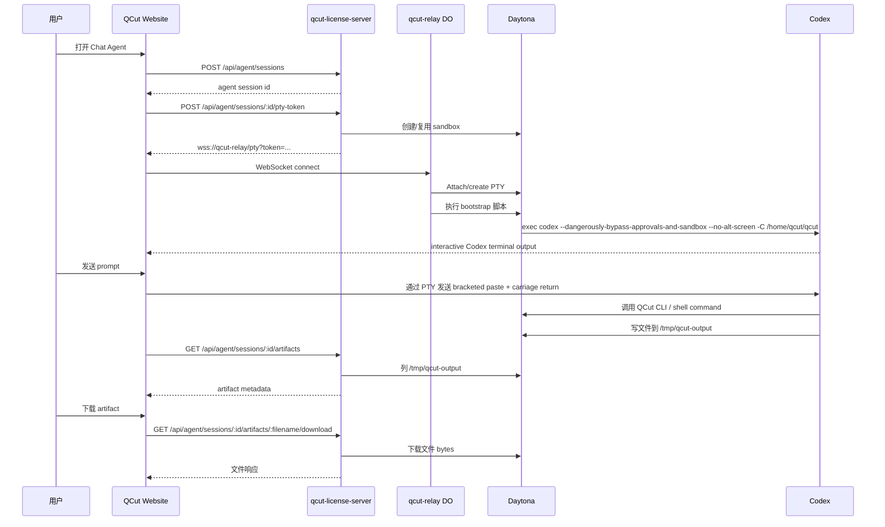

# 11 Chat Agent 运行流程

这份文档描述 `qcut-cli-v2` merge 以及 `v2026.05.16.1` release 之后的真实
生产流程。

最重要的理解模型：

> Chat Agent 页面确实显示的是一个浏览器里的 terminal，但它不是让用户自己
> 配置的普通 shell。Connect 之后，relay 会自动在 Daytona sandbox 里启动
> 一个已经授权好的 interactive Codex CLI。

## 用户流程

1. 用户打开 `https://quriosity.com.au/chat-agent.html`。
2. 页面通过 `qcut-license-server` 创建或复用 agent session。
3. 页面向 `qcut-license-server` 请求短期 PTY WebSocket token。
4. 浏览器通过 WebSocket 连接 `qcut-relay`。
5. `qcut-relay` attach 到这个 session 的 Daytona PTY。
6. `qcut-relay` 在 PTY 里自动跑 bootstrap 脚本。
7. bootstrap 脚本直接进入 interactive Codex。
8. 用户从网页发送 prompt。
9. prompt 被 paste 到同一个长期运行的 Codex TUI 里。
10. Codex 在 sandbox 里调用 QCut CLI 或 shell command。
11. 写到 `/tmp/qcut-output` 的文件会出现在 Artifacts 面板。
12. 用户通过 license-server 的 download route 下载 artifacts。

## 组件职责

| 组件 | 职责 |
| --- | --- |
| `packages/nexusai-website/chat-agent.html` | 用户看到的 Chat Agent 页面。 |
| `packages/nexusai-website/js/agent-chat.js` | 创建 session、连接 WebSocket、渲染 terminal、发送 prompt、轮询 artifacts。 |
| `packages/license-server/src/routes/agent.ts` | 负责 auth、session 创建/复用/结束、PTY token、artifact list/download。 |
| `packages/qcut-relay/src/pty-session.ts` | Cloudflare Durable Object，把 browser WebSocket 桥接到 Daytona PTY。 |
| Daytona sandbox | 运行 QCut image，并承载 interactive Codex CLI。 |
| Codex CLI | 长期运行的 agent process，接收用户 prompt 并执行命令。 |
| `/tmp/qcut-output` | 可下载文件的约定目录。 |

## 调用顺序



## Connect 到底做了什么

Connect 不是简单打开一个 raw terminal。

WebSocket attach 之后，`qcut-relay` 会向 PTY 发送启动脚本。这个脚本会：

1. 跑 `/usr/local/bin/qcut-entrypoint /bin/true`。
2. 切到 `/home/qcut/qcut`。
3. 创建 `/tmp/qcut-output` 和 `/tmp/qcut-tools`。
4. 把 `/home/qcut/qcut` 写进 `/home/qcut/.codex/config.toml`，让 Codex
   信任这个 project。
5. 把 QCut Chat Agent 默认说明追加到 `/home/qcut/qcut/AGENTS.md`。
6. 临时关闭 PTY echo，避免用户在 terminal scrollback 里看到 bootstrap
   heredoc。
7. 用下面命令启动 Codex：

```bash
codex --dangerously-bypass-approvals-and-sandbox --no-alt-screen -C /home/qcut/qcut
```

所以用户进入页面后，应该直接看到 interactive Codex TUI。用户不需要手动输入
`codex`，不需要 approve command，也不需要回答 workspace trust prompt。

## Codex 怎么知道 QCut

relay 会在 sandbox 的 `AGENTS.md` 里写入 QCut 专用 section。这个 section
告诉 Codex：

- 它是运行在 Daytona sandbox 里的 QCut website Chat Agent。
- QCut 图片/视频相关任务优先使用 native QCut CLI。
- native CLI skill 路径是
  `/home/qcut/qcut/.claude/skills/native-cli/SKILL.md`。
- 遇到复杂 QCut workflow 或命令不确定时，先读这个 skill。
- 用户最终要下载的文件必须写到 `/tmp/qcut-output`。
- 临时工具、cache、package install 放到 `/tmp/qcut-tools` 或 `/tmp`，不要
  放进 `/tmp/qcut-output`。

这样第一条用户可见消息就是用户真正的任务，不会被内部 bootstrap prompt
占掉。

## 网页的 prompt 怎么进入 Codex

网页现在不再每一轮启动一个新的 `codex exec`。

`agent-chat.js` 会发送：

1. bracketed paste start。
2. 清理过的用户 prompt。
3. bracketed paste end。
4. carriage return。

这等价于用户把 prompt 粘贴进已经打开的 Codex TUI，然后按 Enter。

因为 Codex process 是同一个，后续消息可以复用同一个 conversation，也能复用
同一个 sandbox 里的文件系统状态。

## Session 生命周期

`qcut-license-server` 用 `agent_sessions` 保存 persistent session。

当前行为：

- 如果用户已有未过期的 active session，就复用最新的那个。
- Daytona sandbox 跟着这个 session 复用。
- 页面上的 New 会结束旧 session，下次 connect 时创建新的。
- session 有硬过期时间，也可以被后端清理。

实际效果：

- PTY 连接还在时，普通 follow-up 会进入同一个 Codex process。
- sandbox 里的文件、工具、工作目录会跨轮保留。
- 新 session 会给用户一个干净 sandbox。

## Artifact 约定

Codex 和 QCut job 必须把最终可下载产物写到：

```bash
/tmp/qcut-output
```

网页轮询：

```text
GET /api/agent/sessions/:sessionId/artifacts
```

license-server 会先用 Daytona `fs.listFiles()` 列 `/tmp/qcut-output`。如果
这个路径没有返回可用文件，会 fallback 到 Daytona process namespace 里用
shell 列 `/tmp/qcut-output`。

下载走：

```text
GET /api/agent/sessions/:sessionId/artifacts/:filename/download
```

download route 会校验 filename，然后从 Daytona 流式下载 bytes。浏览器不需要
直接拿 Daytona credential。

## 安全边界

- 浏览器只拿到短期 relay token。
- relay 打开 WebSocket 前会验证 token。
- relay token 只绑定一个 `agent_sessions.id`。
- license-server 会按登录用户或默认 agent account 限定 session 和 artifact。
- Codex 使用 bypass approval，是因为隔离边界在 Daytona sandbox，不在用户本机。
- trusted project 只写 sandbox 里的 `/home/qcut/qcut`。

## 当前生产验证

部署后已经验证：

- 新 Daytona session 通过已部署的 `qcut-relay` 成功连接。
- Codex 默认以 YOLO mode 打开。
- 没有 workspace trust prompt。
- bootstrap 没有把 `AGENTS.md` heredoc 泄漏到 terminal scrollback。
- 通过 PTY 发送 prompt 后，Codex 创建了
  `/tmp/qcut-output/direct-1778919565593.txt`。
- Artifacts API 能列出该文件。
- download endpoint 返回了匹配内容。

## 网页截图验证 - 2026-05-16

这次用 Playwright 直接跑生产页面：
`https://quriosity.com.au/chat-agent.html`。

截图目录：

- `/Users/peter/Desktop/code/qcut/qcut/output/playwright/chat-agent-runtime-flow-1778959460163`
- `/Users/peter/Desktop/code/qcut/qcut/output/playwright/chat-agent-runtime-flow-success-1778959959684`

### Flow A：按你要求的“手动 Connect”预期

目标：确认没按 Connect 之前不进入 Codex；按了 Connect 之后才启动 Codex。

结果：部分失败。

| 步骤 | 预期 | 实际 | 状态 | 截图 |
| --- | --- | --- | --- | --- |
| fresh load，没点按钮，400ms | terminal idle / 未连接 | 状态已经是 `connecting`；terminal 还显示 fallback text | “还没进 Codex”通过；“还没开始连接”失败 | `01-initial-load-no-click-400ms.png` |
| fresh load，没点按钮，8s | 仍然 disconnected / 没有 Codex | 状态 `connected`；terminal 已经显示 OpenAI Codex + YOLO mode | 失败 | `02-no-click-after-8s.png` |
| Codex ready | 按 Connect 后 Codex ready | Codex ready 了，但它是 auto-connect 触发的，不是用户点击触发的 | Codex 启动通过；手动触发语义失败 | `03-codex-ready.png` |
| 点击 Disconnect | 应该断开 terminal | 状态变成 `disconnected` | 通过 | `04-after-disconnect-click.png` |
| Disconnect 后再点 Connect | 应该重新进入 live Codex connection | terminal 仍然显示旧 Codex 内容，但状态后来掉到 `disconnected`；后续 prompt 不稳定 | 失败 / flaky | `05-after-manual-connect-click-codex.png`、`06-turn-one-prompt-visible.png`、`07-turn-two-command-ran.png` |

主要发现：

- 当前生产页面在 `initAgentChatPage()` 最后会调用
  `autoConnectAgentTerminal()`。也就是说用户不点 Connect，页面加载后也会
  自动开始连接。
- 这和新的手动流程预期冲突：如果设计是“按 Connect 才启动 sandbox/Codex”，
  当前实现不符合。

次要发现：

- 点击 Disconnect 后，terminal 里仍然保留旧 Codex 输出。测试里如果只看
  terminal text，很容易把旧内容误认为新连接成功。
- Disconnect 后再 Connect 的路径里，状态后来变成 `disconnected`，导致
  prompt submission 不稳定。

### Flow B：当前生产的 auto-connected 流程

目标：验证当前已部署行为在不 Disconnect 的情况下是否可用。

结果：成功。

| 步骤 | 预期 | 实际 | 状态 | 截图 |
| --- | --- | --- | --- | --- |
| fresh load，500ms | 页面还没显示 Codex | 状态已经 `connecting`；fallback text 仍可见 | “还没进 Codex”通过；同时证明 auto-connect 已开始 | `01-load-500ms-before-user-click.png` |
| 等待 ready | Codex 在 terminal 打开 | 状态 `connected`；OpenAI Codex 以 YOLO mode 打开 | 通过 | `02-auto-connected-codex-ready.png` |
| 第一轮 prompt | prompt 进入 persistent Codex | marker `WEB_SUCCESS_TURN_ONE_1778959959684` 出现在 terminal/chat flow | 通过 | `03-turn-one-marker-visible.png` |
| 第二轮 prompt | Codex 执行命令创建 artifact | terminal 显示 `Ran mkdir -p /tmp/qcut-output ... web-success-1778959959684.txt` | 通过 | `04-turn-two-terminal-visible.png` |
| Artifacts | 文件出现在网页 Artifacts 面板 | `web-success-1778959959684.txt`，34 bytes，Download button 可见 | 通过 | `05-artifact-panel-visible.png` |

这证明当前生产路径在 auto-connect 且 socket 保持连接时是工作的：

1. 页面能进入 interactive Codex。
2. website Send button 能把 prompt 送进这个 Codex session。
3. 后续 prompt 能继续执行命令。
4. 写到 `/tmp/qcut-output` 的文件能出现在 Artifacts。

## 手动 Connect 语义的修复计划

如果目标 UX 是“用户不点 Connect 就不启动 sandbox/Codex”，下一步应该：

1. 从 `initAgentChatPage()` 移除 `autoConnectAgentTerminal()`。
2. 默认只允许 Connect button 调用 `connectAgentTerminal()`。
3. Send 可以保留便利逻辑，但必须在用户点 Send 后才显式调用
   `connectAgentTerminal()`。
4. Disconnect / New Session 时清空或重置 terminal 内容，避免旧 Codex 输出
   被误判成新连接。
5. WebSocket close handler 里设置 `terminalSocket = null`。
6. terminal status 是 `connecting` 时禁用 Send。
7. 测试里不能只判断 terminal text 包含 `OpenAI Codex`，还要判断状态是
   `connected`，并最好带一个当前 session marker。

## 它不是什么

对 website Chat Agent 路径来说，它现在已经不是纯队列式 job runner。
旧的 `agent_jobs -> worker -> codex exec -> upload -> delete sandbox` 模型对
headless job 仍然有用，但 website Chat Agent 路径现在是 persistent Daytona
PTY + interactive Codex。
