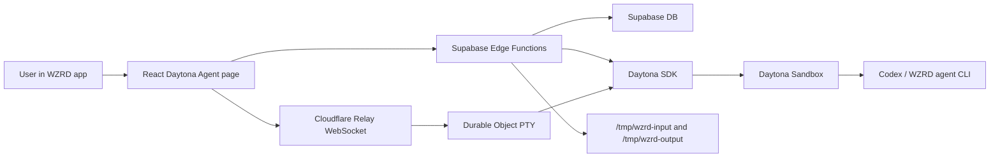

# Porting QCut Daytona Agent Into WZRD Agent Studio: Overview

## Goal

This directory explains how to add QCut's Daytona online chat agent capability to `<WZRD_ROOT>`.

The goal is not to copy the QCut implementation wholesale. The clean split is:

1. **WZRD React page**: rewrite QCut's static `chat-agent.html` and plain JavaScript behavior as WZRD routes, hooks, and components.
2. **WZRD Supabase Edge Functions**: port QCut `license-server` agent route logic into Supabase functions and `_shared` modules.
3. **Standalone Cloudflare Relay Worker**: keep QCut `qcut-relay`'s WebSocket + Durable Object shape, adapted for WZRD.

## Current WZRD State

WZRD already has a logical agent session table:

- `<WZRD_ROOT>/supabase/migrations/20260503191248_add_wzrd_agent_sessions_and_export_indexes.sql`
- `<WZRD_ROOT>/supabase/functions/_shared/wzrdAgentContract.ts`
- `<WZRD_ROOT>/supabase/functions/generate-workflow/index.ts`

That table supports the `generate-workflow` planning/materialize/repair flow. A Daytona online chat agent is a different runtime capability: it needs a real sandbox, PTY, file upload/download, relay tokens, and runtime audit events.

Do not overload the existing `wzrd_agent_sessions` table with Daytona runtime state. Add a dedicated table such as `daytona_agent_sessions` or `wzrd_daytona_sessions`, linked back to WZRD projects through `project_id`.

## Recommended Architecture

## Request Flow

1. The user opens a WZRD route such as `/agent` or `/projects/:projectId/agent`.
2. The React page calls the `agent-session` Supabase function.
3. The function authenticates the Supabase JWT with WZRD `_shared/auth.ts`.
4. The function creates or reuses a Daytona sandbox.
5. The function records a runtime session row in the new Daytona session table.
6. The frontend requests a short-lived signed relay token from `agent-pty-token`.
7. The frontend opens a WebSocket to the Cloudflare relay.
8. The relay validates the token, attaches to the Daytona sandbox PTY, and starts the WZRD agent command.
9. The frontend uploads files through `agent-files`; the function writes them to `/tmp/wzrd-input`.
10. The agent writes deliverables to `/tmp/wzrd-output`; the frontend lists/downloads them through `agent-files`.

## Why The Relay Should Stay A Cloudflare Worker

Supabase Edge Functions are a good fit for authenticated HTTP APIs. The terminal bridge needs long-lived WebSocket state, PTY session lifecycle management, input acknowledgements, reconnect behavior, and per-session runtime state. QCut already solves this with Cloudflare Worker + Durable Object:

- `packages/qcut-relay/src/index.ts`
- `packages/qcut-relay/src/pty-session.ts`
- `packages/qcut-relay/src/verify-token.ts`

For WZRD, copy that package shape into a WZRD relay package and adapt environment names, startup commands, audit logging, and Daytona image assumptions.

## High-Level Decisions

| Area | Recommendation |
| --- | --- |
| Frontend | Rewrite in React. Do not copy QCut static HTML directly. |
| API server | Port QCut Hono route logic into Supabase Edge Functions. |
| Relay | Copy QCut relay package and adapt it. |
| DB | Add dedicated Daytona runtime tables. Keep existing `wzrd_agent_sessions` for logical workflow generation. |
| Container image | Build a WZRD-specific Daytona image. Do not use the QCut image as the final image. |
| Sandbox file paths | Use `/tmp/wzrd-input` and `/tmp/wzrd-output`. |
| Tests | Add Supabase function tests, relay unit tests, React tests, and one browser e2e smoke. |

## Suggested Reading Order

1. `COPY-MAP.md`: what to copy, adapt, or avoid copying from QCut.
2. `NEW-FILES.md`: which files to create in WZRD and what each should contain.
3. `IMPLEMENTATION-STEPS.md`: implementation and verification sequence.
4. Chinese versions: `README.zh.md`, `COPY-MAP.zh.md`, `NEW-FILES.zh.md`, `IMPLEMENTATION-STEPS.zh.md`.

