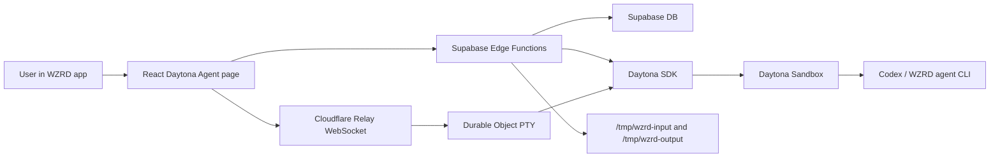

# WZRD Agent Studio 接入 QCut Daytona Agent：总览

## 目标

这个目录说明如何把 QCut 里的 Daytona online chat agent 能力迁移到 `/Users/peter/Desktop/code/wzrdagentstudio`。

目标不是把 QCut 代码整包复制过去，而是拆成三层：

1. **WZRD React 页面**：把 QCut 的静态 `chat-agent.html` 和 plain JS 行为改写为 WZRD 的 React route、hooks、components。
2. **WZRD Supabase Edge Functions**：把 QCut `license-server` 的 agent route/parts 逻辑迁移为 Supabase Edge Function 和 `_shared` 模块。
3. **独立 Cloudflare Relay Worker**：保留 QCut `qcut-relay` 的 WebSocket + Durable Object 形态，改成 WZRD 专用 relay。

## 当前 WZRD 状态

WZRD 已经有一个逻辑型 agent 表：

- `/Users/peter/Desktop/code/wzrdagentstudio/supabase/migrations/20260503191248_add_wzrd_agent_sessions_and_export_indexes.sql`
- `/Users/peter/Desktop/code/wzrdagentstudio/supabase/functions/_shared/wzrdAgentContract.ts`
- `/Users/peter/Desktop/code/wzrdagentstudio/supabase/functions/generate-workflow/index.ts`

这个表当前服务于 `generate-workflow` 的 planning/materialize/repair 流程。Daytona online chat agent 是另一类能力：它需要真实 sandbox、PTY、文件上传下载、relay token、runtime audit。

建议不要把 Daytona runtime 字段硬塞进现有 `wzrd_agent_sessions`。更清晰的做法是新增 `daytona_agent_sessions` 或 `wzrd_daytona_sessions`，并用 `project_id` 与 WZRD project 关联。

## 推荐架构

## Request Flow

1. User opens a WZRD page, for example `/agent` or `/projects/:projectId/agent`.
2. React page calls `agent-session` Supabase function.
3. Supabase function authenticates the Supabase JWT using WZRD `_shared/auth.ts`.
4. Function creates or reuses a Daytona sandbox.
5. Function records a runtime session row in the new Daytona session table.
6. Frontend asks `agent-pty-token` for a short-lived signed relay token.
7. Frontend opens WebSocket to Cloudflare relay.
8. Relay validates JWT, attaches to Daytona sandbox PTY, and starts the WZRD agent command.
9. Frontend uploads files through `agent-files`; function writes them to `/tmp/wzrd-input`.
10. Agent writes deliverables to `/tmp/wzrd-output`; frontend lists/downloads through `agent-files`.

## Why Relay Stays Cloudflare Worker

Supabase Edge Functions are good for authenticated HTTP APIs. The terminal bridge needs long-lived WebSocket state, PTY session management, input acknowledgements, reconnect behavior, and per-session runtime state. QCut already solved this with Cloudflare Worker + Durable Object:

- `packages/qcut-relay/src/index.ts`
- `packages/qcut-relay/src/pty-session.ts`
- `packages/qcut-relay/src/verify-token.ts`

For WZRD, copy that package shape into a WZRD relay package and adjust environment names, command startup text, audit logging, and Daytona image assumptions.

## High-Level Decisions

| Area | Recommendation |
| --- | --- |
| Frontend | Rewrite in React. Do not copy QCut static HTML directly. |
| API server | Port QCut Hono route logic into Supabase Edge Functions. |
| Relay | Copy QCut relay package and adapt it. |
| DB | Add dedicated Daytona runtime tables. Keep existing `wzrd_agent_sessions` for logical workflow generation. |
| Container image | Build a WZRD-specific Daytona image. Do not use QCut image as the final image. |
| File paths in sandbox | Use `/tmp/wzrd-input` and `/tmp/wzrd-output`. |
| Tests | Add Supabase function tests, relay unit tests, React tests, and one browser e2e smoke. |

## Suggested Document Reading Order

1. `COPY-MAP.zh.md`：哪些 QCut 文件 copy、adapt、不要 copy。
2. `NEW-FILES.zh.md`：WZRD 里要新增哪些文件，每个文件大致写什么。
3. `IMPLEMENTATION-STEPS.zh.md`：实际落地步骤和测试顺序。
4. `README.md` / `COPY-MAP.md` / `NEW-FILES.md` / `IMPLEMENTATION-STEPS.md`：英文版本。

