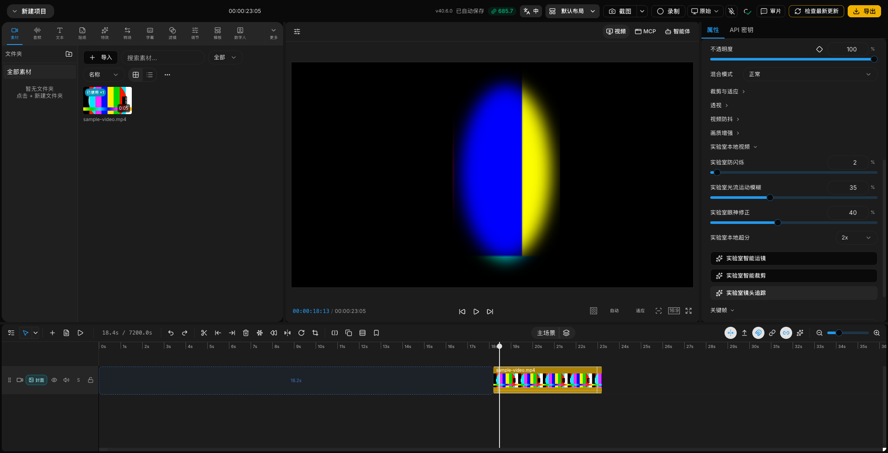

# QCut Local Video Lab Implementation and E2E

> Implemented: 2026-08-30; Jianying private-provider update: 2026-08-31
>
> Scope: deflicker, optical-flow motion blur, smart motion, smart crop, camera tracking, eye correction, local super resolution, and the existing stabilization, denoise, and frame interpolation controls

## Visible UI

Select a video clip and open `Video > Basic`. The `Local video lab` group is expanded by default and exposes seven explicitly experimental controls:

- `Lab deflicker`
- `Lab optical-flow motion blur`
- `Lab smart motion`
- `Lab smart crop`
- `Lab camera tracking`
- `Lab eye correction`
- `Lab local super resolution`

Verified UI screenshot:

Panel close-up: `evidence/qcut-media-lab-panel.png`

## Actual capability status

| Target | QCut entry | Local | Honest implementation boundary |
| --- | --- | --- | --- |
| Deflicker | Lab deflicker | Yes | Explicit on-device path through Jianying 11.3.0 `VideoDeflickerGpuBackend` and derived media; public FFmpeg `deflicker` remains the fallback |
| Stabilization | Video stabilization > Local stabilization | Yes | Existing FFmpeg `deshake`; not Jianying VAS 2.0.0 |
| ByteNN denoise | Quality enhancement > Video denoise | Yes | Existing FFmpeg `hqdn3d`; the private ByteNN model remains probe-only |
| UMVFI interpolation | Speed > Smart frame interpolation | Yes | Existing motion-compensated FFmpeg `minterpolate`; not UMVFI 3.2.0 |
| Optical-flow motion blur | Lab optical-flow motion blur | Yes | 4x `minterpolate`, temporal `tmix`, then restoration to project fps |
| Smart motion | Lab smart motion | Yes | Converts a local MediaPipe/optical-flow person track into pan and slow push-in keyframes |
| Smart crop | Lab smart crop | Yes | Generates bounded translation and scale keyframes around the tracked subject |
| Camera tracking | Lab camera tracking | Yes | Converts local tracked centers into editable X/Y clip keyframes |
| Eye correction | Lab eye correction | Yes on this machine | Uses the existing local portrait runtime for bright-eye and eye-bag treatment; it does not redirect gaze |
| AI super resolution | Lab local super resolution | Yes | Lanczos 2x/4x, light sharpening, and target-size reconstruction; this is not presented as an AI model |

## Processing model

The four continuous settings are persisted on each clip as `labDeflicker`, `labOpticalFlowMotionBlur`, `labEyeCorrection`, and `labLocalSuperResolution`.

Without the local-cache action, deflicker, motion blur, and local super resolution share the FFmpeg frame-preview, proxy-preview, and export chain. `Process with local Jianying cache` instead runs the full clip through an isolated native host, validates and caches a derived MP4, replaces the timeline media, and resets `labDeflicker` so export cannot apply the fallback twice. See [the private deflicker provider report](./PRIVATE_RUNTIME_DEFLICKER.en.md).

Smart motion, smart crop, and camera tracking consume a completed local Mask track whose source is `mediapipe` or `optical-flow`. They generate ordinary `x`, `y`, `scaleX`, and `scaleY` keyframes, so the result remains undoable and editable and uses the existing export path.

Lab eye correction merges conservative eye-detail values into the existing local portrait state. It also forces fixed-timestamp renderer export so the treatment cannot exist only in preview. It is intentionally not described as gaze-to-camera correction.

## Local-use boundary

- The three FFmpeg features, tracking-to-keyframe tools, and Jianying on-device deflicker require no network. The private host explicitly runs with network denied.
- Smart tools require a ready local person track. Their buttons stay disabled until that prerequisite exists.
- Eye treatment requires QCut's private local portrait runtime. This machine has the private runtime snapshot; Jianying libraries and models are not committed, packaged, or redistributed.
- A standalone `inspect()` diagnostic (the API takes no options) did not return within 90 seconds and was terminated. The properties panel does not call this blocking refresh. Any future availability UI should use cached status and a timeout.
- Deflicker now has a verified consecutive-frame ABI. ByteNN, UMVFI, VAS, VMB, gaze correction, and local AI super-resolution still lack complete stable frame-processing ABIs, so the remaining controls continue to use verifiable QCut implementations without borrowing private product names.

## Verification

- Unit/integration: 13 files, 95 tests passed.
- Electron build: passed.
- Web TypeScript: passed.
- Web production build: passed with pre-existing route, dynamic-import, and chunk-size warnings.
- Real packaged FFmpeg: rendered a three-second H.264 result at 640 x 360, 30 fps, 90 frames in 5.66 seconds.
- Electron Playwright E2E: passed in 19.3 seconds after a real project creation, video import, seek into the clip, pointer slider drag, all three smart-action clicks, persisted settings check, keyframe count check, and a non-empty preview assertion.
- Private deflicker visible-UI E2E: real-person import, button processing, changed media ID, non-empty derived file, strength reset, non-empty preview, screenshot, and state JSON; `1 passed (10.7s)`.

Evidence:

- `evidence/qcut-media-lab-ui.png`
- `evidence/qcut-media-lab-panel.png`
- `evidence/qcut-lab-source.mp4`
- `evidence/qcut-lab-render.mp4`
- Source SHA-256: `baf7ff3b48c36aa4cf1501b37aa12e1aa4ba4b64a7a506ee17d53cd9c025a8b4`
- Output SHA-256: `150cb93205fcc5590115a0263bf69d0179d79b0817a82a2a708ee44a2d9f855a`

## Follow-up work

1. Extend the private-deflicker derived-media cache model to long motion-blur and reconstruction jobs.
2. Add a real-face before/after pixel assertion for the lab eye treatment.
3. Add ByteNN, UMVFI, gaze redirection, or local AI super-resolution only after a legal, stable, redistributable provider exposes a complete processing API.
