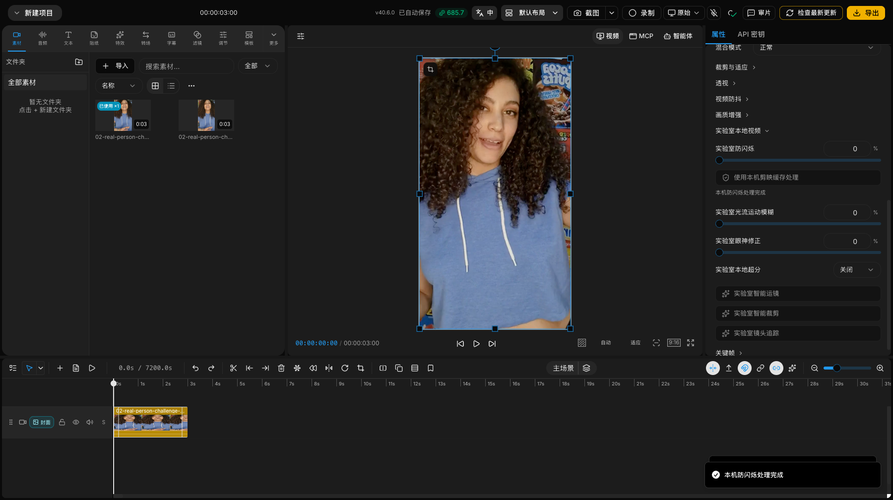

# QCut 剪映本机缓存防闪烁 Provider

> 完成日期：2026-08-31
> 目标版本：剪映专业版 macOS 11.3.0
> 支持平台：Apple Silicon macOS
> 边界：只使用用户本机已有的私有缓存，不上传、不提交、不随 QCut 分发

## 已经做了什么

QCut 的“实验室防闪烁”现在有第一条真实剪映本机运行时路径。它不再只证明模型能够加载，而是把连续 BGRA 视频帧送入 `VideoDeflickerGpuBackend`，得到处理后的帧，再编码成可复用的派生 MP4。

用户在 `画面 > 基础 > 实验室本地视频` 中设置强度后，可以点击 `使用本机剪映缓存处理`。成功后 QCut 会：

1. 校验本机运行时版本、清单、文件大小和 SHA-256。
2. 解码原视频，使用剪映 Lens/Metal 防闪烁后端逐帧处理。
3. 以 H.264 CRF 16、AAC 192 kbps 写出 MP4，并保留原尺寸、平均帧率、时长和音频。
4. 校验输出媒体规格后原子发布到 QCut 缓存。
5. 把时间线片段替换为派生视频，并把 `labDeflicker` 归零，避免最终导出再次叠加 FFmpeg 回退。



## 处理架构

```text
源 MP4
  -> FFmpeg 解码为 BGRA
  -> macOS FIFO
  -> QCut 原生宿主
  -> 剪映 VideoDeflickerGpuBackend + Metal 缓存
  -> macOS FIFO
  -> FFmpeg H.264/AAC 编码
  -> ffprobe 规格校验
  -> QCut 派生媒体缓存
  -> 时间线替换
```

原生宿主在 `sandbox-exec` 的禁止网络配置中运行。帧不经过 JavaScript 流，也不写成磁盘 raw 文件；两个命名管道只存在于任务临时目录，任务结束后删除。

缓存键包含源路径、源文件大小和修改时间、强度、运行时身份与路由版本。命中缓存前仍会用 `ffprobe` 复查尺寸、帧率、时长和音频；损坏或不匹配的缓存会删除并重建。

## 兼容与隐私门禁

当前 Provider 只接受精确的剪映 `11.3.0` 私有快照。QCut 会验证：

- 防闪烁 Metal 库 SHA-256：`0d398bb6a77650a5a07c038473e54ba488443821257f7fa729a9be0e05c777db`
- `liblens.dylib` SHA-256：`fdf576dd066a11db7b54d815621893ed62a8ed223e22834d5753738dc66df161`
- `libfastcv.dylib`、`libbytenn.dylib`、`libIESAppLogger.dylib` 的固定哈希
- Lens 清单中的 `localOnly: true` 和 `cloudUpload: false`

版本或哈希不一致时不会猜 ABI，也不会偷偷回退到未知私有二进制。QCut 公共代码只包含自己编写的原生桥；剪映 dylib、模型和缓存始终留在：

```text
~/Library/Application Support/QCut/PrivateRuntimes/JianyingBasicVideo/current
~/Library/Application Support/QCut/PrivateRuntimes/JianyingTransition/current
```

这些私有文件不进入 Git、QCut 安装包或公共下载。这里证明的是本机互操作能力，不代表获得再分发许可。

## CLI

```bash
qcut edit deflicker \
  -i /absolute/path/source.mp4 \
  --strength 70 \
  --output /absolute/path/result.mp4
```

`--strength` 必须是 `1-100` 的整数，默认 `70`。已有输出不会被覆盖，除非显式传入 `--force`。CLI 和 UI 使用同一个 Provider、缓存、取消机制和输出校验。

## 真人视频结果

同一条 `360 x 640`、24 fps、72 帧、3 秒真人挑战轨在强度 70 下得到：

| 指标 | QCut 剪映私有 Provider | 剪映 UI 导出 |
| --- | ---: | ---: |
| 帧亮度标准差变化 | `-3.305%` | `-1.172%` |
| 空间细节变化 | `-1.403%` | `-4.861%` |
| 时域差变化 | `-0.907%` | `+0.125%` |
| 对各自基线 SSIM | `0.982599` | `0.976897` |
| 输出 | 72 帧 / 3.000 秒 | 90 帧 / 3.000 秒 |

两边基线帧率和导出链不同，因此这些数字用于证明真实生效和变化方向，不是逐像素同算法校准。QCut 输出 SHA-256 为 `824e11b75d4618e16b2db18e6f20e13cf14d1e7623c11d64f5b857174fae4960`。

## 已完成 E2E

- 原生 ABI：90 帧连续输入，`51,992,477` 个字节发生变化。
- CLI 冷运行：640 x 360、90 帧约 `0.98s`；相同输入缓存命中约 `0.06s`。
- 真人 CLI：360 x 640、72 帧约 `0.63s`。
- 带音频真人 CLI：最新冷路径 3 秒 H.264 + AAC 输出约 `0.63s`，音频流保留。
- 打包态模拟：从 `resources/bin/qcut-jianying-deflicker-host` 启动并完成 90 帧处理。
- 可见 Electron UI：创建项目、导入真人素材、输入强度、点击按钮、替换时间线、非空预览和截图，Playwright `1 passed (10.7s)`。

证据：

- [UI 状态 JSON](./evidence/real-video-matrix/qcut-private-deflicker-ui.json)
- [四路静帧对比](./evidence/real-video-matrix/qcut-private-deflicker-contact-sheet.png)
- [机器可读指标](./evidence/real-video-matrix/qcut-jianying-real-video-metrics.json)
- [QCut 私有 Provider 输出](./evidence/real-video-matrix/qcut-private-deflicker.mp4)

## 仍然没有完成的部分

- 目前只把防闪烁提升到私有运行时 `input-processed`。VAS 防抖、ByteNN 降噪、UMVFI 补帧和 VMB 运动模糊仍缺完整、稳定的帧处理 ABI。
- 剪映 UI 强度与低层 `strength` 的精确映射尚未校准。
- 当前仅支持 Apple Silicon macOS 和剪映 11.3.0 精确快照。
- QCut 仍保留 FFmpeg `deflicker` 作为无需私有缓存的公开回退；只有点击本机缓存按钮后才会生成并替换派生视频。
