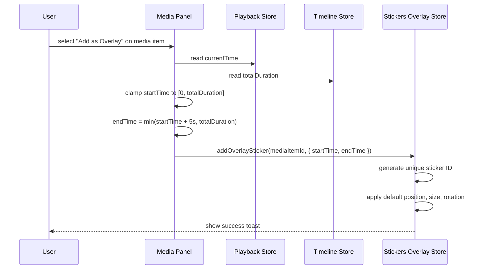
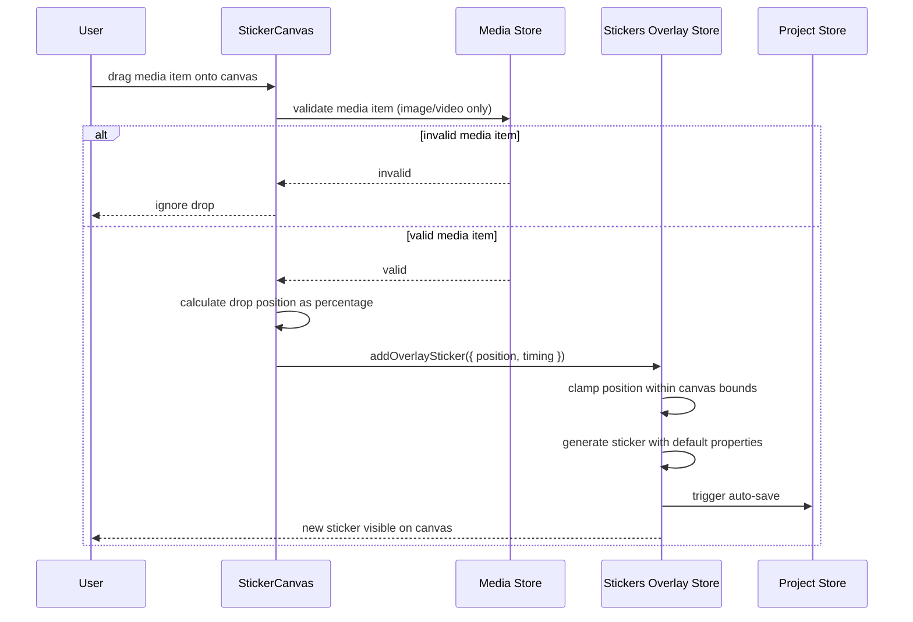
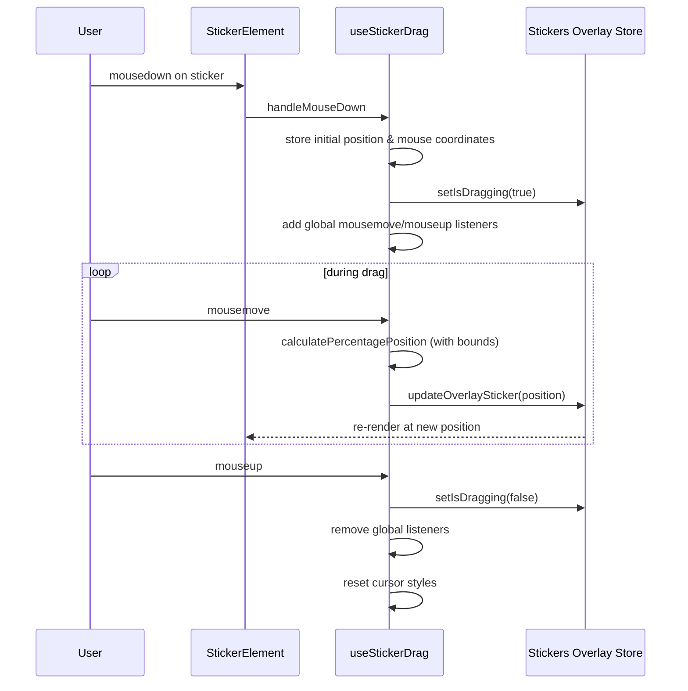
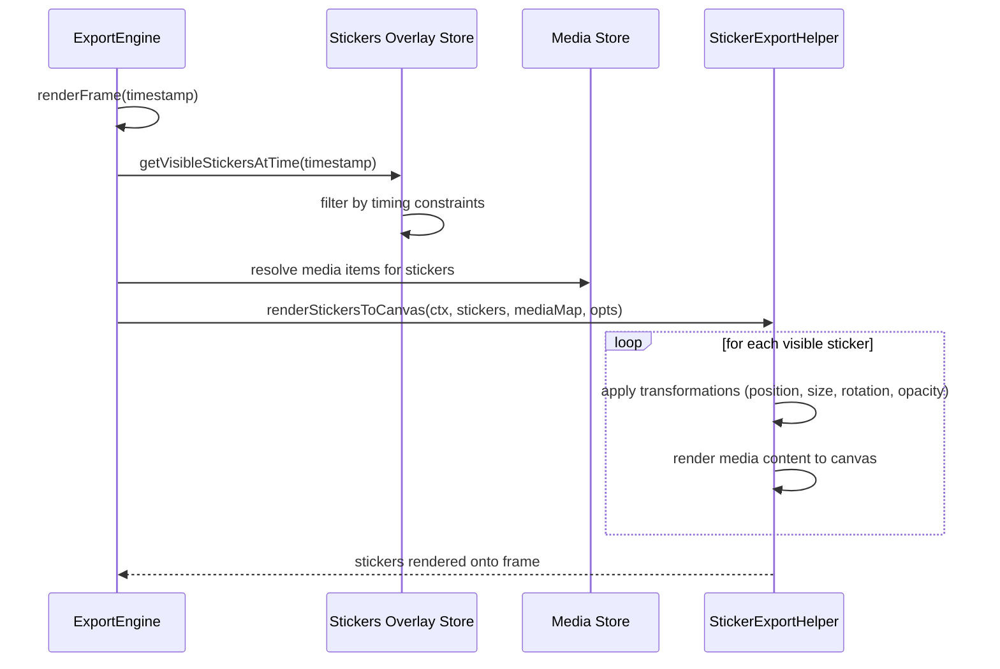
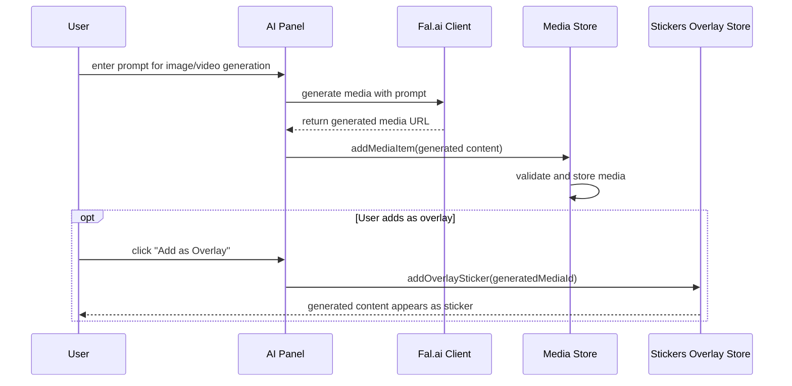

# Stickers Overlay System Overview

## Architecture

The stickers overlay system allows users to add images and videos as overlay elements on top of the video preview. It's designed as a separate system from the timeline to maintain simplicity and independence.

### Key Components

1. **Stickers Overlay Store** (`src/stores/stickers-overlay-store.ts`)
   - Manages overlay stickers state using Zustand
   - Handles sticker CRUD operations
   - Manages selection, z-index, and visibility
   - Provides project persistence integration

2. **StickerCanvas** (`src/components/editor/stickers-overlay/StickerCanvas.tsx`)
   - Main overlay canvas component
   - Handles drag-and-drop from media panel
   - Manages canvas-level interactions
   - Renders all sticker elements

3. **StickerElement** (`src/components/editor/stickers-overlay/StickerElement.tsx`)
   - Individual sticker component
   - Handles dragging, selection, and rendering
   - Integrates with resize handles and controls

4. **Drag System** (`src/components/editor/stickers-overlay/hooks/useStickerDrag.ts`)
   - Custom hook for drag functionality
   - Boundary constraints with sticker dimension awareness
   - Touch support for mobile/tablet
   - Memory leak prevention with stable refs

5. **Resize Handles** (`src/components/editor/stickers-overlay/ResizeHandles.tsx`)
   - Interactive resize controls
   - Maintains aspect ratio option
   - Corner and edge handles

6. **Auto-Save** (`src/components/editor/stickers-overlay/AutoSave.tsx`)
   - Background persistence to project store
   - Debounced save operations

## Data Flow Diagrams

### Adding Stickers via Media Panel



### Drag and Drop from Media Panel



### Sticker Interaction & Dragging



### Export & Rendering



### AI Generation Integration



## Key Features

### Current Implementation
- ✅ Drag and drop from media panel
- ✅ Context menu "Add as Overlay" option
- ✅ Boundary-aware positioning with sticker dimensions
- ✅ Selection and multi-sticker management
- ✅ Z-index layering system
- ✅ Resize handles with aspect ratio preservation
- ✅ Touch support for mobile/tablet
- ✅ Auto-save to project persistence
- ✅ Memory leak prevention in drag handlers
- ✅ AI-generated content integration
- ✅ Export system integration

### Technical Details

#### Position System
- Uses percentage-based coordinates relative to canvas
- Boundary constraints account for actual sticker dimensions
- Position calculations: `(clientX - rect.left) / rect.width * 100`

#### Timing System
- Default 5-second duration when added via context menu
- Timing constraints: `{ startTime, endTime }` within video duration
- Visibility filtering during playback and export

#### State Management
- Zustand store with devtools integration
- Map-based sticker storage for O(1) lookups
- Separation from timeline store for independence

#### Performance Optimizations
- React.memo for component optimization
- Stable refs in drag handlers to prevent re-renders
- Debounced auto-save operations
- RequestAnimationFrame for smooth dragging

## Integration Points

1. **Media Panel**: Context menu and drag-and-drop source
2. **Timeline Store**: Duration calculations and timing validation
3. **Project Store**: Persistence and project loading/saving
4. **Playback Store**: Current time for visibility filtering
5. **Export Engine**: Frame-by-frame sticker rendering
6. **AI Generation**: Generated content as sticker sources

## File Structure

```
src/components/editor/stickers-overlay/
├── index.ts                    # Central exports
├── StickerCanvas.tsx          # Main canvas component
├── StickerElement.tsx         # Individual sticker rendering
├── ResizeHandles.tsx          # Interactive resize controls
├── StickerControls.tsx        # Sticker property controls
├── AutoSave.tsx              # Background persistence
└── hooks/
    └── useStickerDrag.ts     # Drag functionality hook

src/stores/
└── stickers-overlay-store.ts  # Zustand store

src/types/
└── sticker-overlay.ts         # TypeScript definitions
```

This system provides a robust, performant overlay solution that integrates seamlessly with the existing video editor architecture.