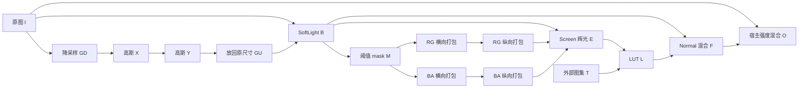

# 电影柔光：算法语义契约

版本：2026-09-06。资源 `7447126702137904420` / `9673f80b8e2f5a07f02f9ce1130b784a`。

本契约定义**不透明SDR图像的固定算法图与两种显式强度模式**：默认`output-mix`保留已对照的静态场景末端混合；`ui-snapshot`按实测剪映导出快照选择内部参数。实现者可根据输入、公式、连接和约束重新实现算法，不需要把既有C++实现当作算法定义。

机器可读版本见 [semantic-contract.json](semantic-contract.json)。算子细节分别见 [Gaussian／Layer](semantic-gaussian-layer.zh.md)、[SGlow](semantic-glow.zh.md)、[生命周期](semantic-lifecycle.zh.md)。来源以精确包的scene、控制脚本、Shader和固定原生输出为准。

## 1. 什么已经确定

| 证据层级 | 含义 | 本例 |
| --- | --- | --- |
| 静态读取 | 当前精确包中直接存在 | scene连接、实际读取的字段、Shader算式 |
| 语义推导 | 由多个静态事实推出 | 居中103%缩放、LUT两次Y翻转抵消、工作尺寸 |
| 输出验证 | 相同输入与固定原生终点比较 | 三种输入、两种强度，RGB MAE 0.006540–0.054485 |
| 实现约定 | 独立实现选定的边界 | top-down布局、明确舍入、拒绝透明整链输入 |
| 待确认 | 缺少执行或状态证据 | 旧CGL逐Pass分配、包内事件的宿主依赖 |

不能把末端输出接近升级为已截获每个原生Pass。原生参考来自D634私有兼容CGL宿主；安装版11.3.0的AGFX格式映射是另一份证据。

整链输入为紧密排列的 `W×H×4` RGBA8，所有Alpha=255。运算对象是归一化通道值，未加入ICC或额外sRGB转换；Gaussian的gamma幂运算属于该算子的步骤，不代表整链做了标准sRGB解码。

## 2. 逻辑数据流



只有一个SGlow实例。RG／BA两对卷积从同一mask分别开始。最终Normal的base为B。上图末端O表示默认`output-mix`，原图I需保留到其混合完成；`ui-snapshot`输出F，不再执行末端混合。

| ID | 运算及输入 | 输出尺寸 | RGBA含义 |
| --- | --- | --- | --- |
| GD | resize(I) | `floor(W/2)×floor(H/2)` | 图像颜色／覆盖率 |
| GX | Gaussian X(GD) | 同GD | 图像颜色／覆盖率 |
| GY | Gaussian Y(GX) | 同GD | 图像颜色／覆盖率 |
| GU | resize(GY) | W×H | 图像颜色／覆盖率 |
| B | SoftLight(base=I, source=GU) | W×H | 不透明基础图像 |
| M | 阈值提取(B) | Wg×Hg | 高光颜色／高光权重 |
| HR / VR | 横向(M)／纵向(HR) | Wg×Hg | R高位、R余数、G高位、G余数 |
| HA / VA | 横向(M)／纵向(HA) | Wg×Hg | B高位、B余数、A高位、A余数 |
| E | Screen(B, decode(VR,VA)) | W×H | 不透明辉光图像 |
| L | tiled LUT(E,T) | W×H | 调色图像 |
| F | Normal(base=B, source=L) | W×H | 完整效果 |
| O | output-mix: mix(I,F,intensity)；ui-snapshot: F | W×H | 所选模式输出 |

这是13个算法目标加宿主混合的逻辑描述，不是GPU draw-call实测。GPU资源名可以复用；ID表示数据版本。M必须活到HA读完，即使原场景稍后让VA覆盖同一物理纹理。

## 3. 采样、单位和精度

记 `Q(c)=round(clamp(c,0,1)×255)/255`，对RGBA逐通道应用。每个输出目标按Q写出；卷积累积期间不量化。半值取整是CPU约定，旧CGL驱动精确舍入尚未逐目标测量。

像素中心为 `u=(x+0.5)/width`、`v=(y+0.5)/height`；输入采样位置为 `(u×inputWidth−0.5,v×inputHeight−0.5)`，按四个相邻texel双线性插值。

- clamp复制边缘。Gaussian的Normal边界还会跳过超出轴UV `[0,1]` 的tap并重新归一化。
- mirror将坐标以2为周期折返，用于当前辉光中间纹理。
- LUT在512×512图集的texel中心查表，避免相邻tile串色。
- scene的Layer opacity／scale是百分数，转为0.7／1.03；其余quality、threshold为比例。
- Gaussian半径／步长是UV单位；Glow半径／步长是工作纹理像素单位，采样时除以对应轴像素数。

`.rt`格式43及采样枚举是静态证据。逐目标RGBA8与双线性缩放受到末端对照支持，尚无旧CGL逐目标分配回执。

## 4. 固定场景的数学定义

### Gaussian

固定参数：强度70，quality0.2，横纵强度1，normalizationSize1000，gamma2.2，radius/sigma=2.5，spaceDither0，blurAlpha=true，Normal边界。

```text
R = max(min(W,H), max(W,H)/2)
radiusX = R/W × 70/1000
radiusY = R/H × 70/1000
samples = ((0.5×70+10)×0.66) × 10^(2×0.2−1)
sigmaAxis = radiusAxis/2.5
stepAxis = radiusAxis/samples
```

每轴取中心及两侧 `k=1..floor(samples)`，distance=k×stepAxis，weight=`exp(−0.5×(distance/sigmaAxis)^2)`。每tap先双线性采样，再对RGB做gamma2.2；加权归一化后，对RGB做逆gamma，再Q。Alpha不做gamma。横纵各一次完整往返，不能合并为整链一次。

320×180：工作尺寸160×90；samples≈7.4603027，即每侧7tap；radiusX=0.039375、radiusY=0.07；sigmaX=0.01575、sigmaY=0.028。

### SoftLight

source=GU，base=I；`sourceUV=(outputUV−0.5)/1.03+0.5`。这个居中缩放由相同layer/composite尺寸、anchor=position、零旋转和中性parent推出；未声称与完整投影矩阵具有相同浮点误差。

```text
D(b) = ((16b−12)b+4)b          b < 0.25
       sqrt(b)                 其余
SL(b,s) = b−(1−2s)b(1−b)       s < 0.5
          b+(2s−1)(D(b)−b)     其余
B.rgb = Q(0.3×I.rgb + 0.7×SL(I.rgb, sample(GU,sourceUV).rgb))
B.a = 1
```

上式适用于不透明输入。一般Precomp先把opacity乘到premultiplied source RGBA，再source-over；Adjustment在另一位置插值，两类不能随意互换。

### SGlow

固定参数：threshold0.84、brightness2.4、glowWidth0.13、widthX0.41、widthY0.65、RGB宽度均1、quality0.2、dither1、Reflect、Screen。thresholdAddColor为黑，glowColor为白；sourceOpacity／bgBrightness为1，其余背景／alpha选项为0，无bgTexture。

`workingWidth=min(W,240)`，`Wg=floor(workingWidth)`，`Hg=floor(H×workingWidth/W)`。半径基于未取整workingWidth。对低分辨率中心采样B得c：

```text
f(z) = 0                       z <= 0.84
       (z−0.84)/(1−0.84)        z > 0.84
gain = (f(c.r)+f(c.g)+f(c.b))/max(c.r+c.g+c.b,1e−6)
M = Q(c×gain)                  RGBA都乘gain
```

基础半径r=0.13×workingWidth；X的RGB半径均0.41r，Y均0.65r，Alpha在两轴均r。sigma=radius/2.4，预算K=30。距离从1开始，以 `Δ=max(1,maxRGBRadius/K)` 增长；不大于128、KΔ和最大RGB半径时继续，最多128次。每通道按自身半径及高斯权重累计。**Alpha权重独立，但循环终止由RGB控制。** 当前X侧12tap、Y侧20tap。

两个值a,b打包为 `Q([floor(255a)/255,fract(255a),floor(255b)/255,fract(255b)])`；解包为 `[p.r+p.g/255,p.b+p.a/255]`。存储格点间隔1/65025，后续双线性可产生格点之间的值，不能称为所有阶段固定16位整数。

横向读取原mask的RG或BA；纵向先插值打包纹理、再解包，卷积后重新打包。Screen前同样先插值再解包。精确dither散列／种子见SGlow语义文档；它依赖UV与tap，不读取时间。

```text
blurred = decode(sample(VR),sample(VA))
E.rgb = Q(1−(1−B.rgb)×(1−2.4×blurred.rgb))
E.a = Q(2.4×blurred.a+(1−2.4×blurred.a)×B.a) = 1
```

Screen之前不额外裁剪亮度乘积，裁剪发生于输出Q。M的Alpha是高光权重，打包纹理的Alpha是余数，须按阶段解释通道。

### LUT、Normal和宿主强度

实际字段为 `lutImage=reference map2.png`；额外字段`LutTex=filter.png`未被当前脚本读取。令z=63×E.b，取相邻蓝切片floor(z)、ceil(z)。切片j的查表坐标：

```text
u = ((j mod 8)×64+0.5+63×E.r)/512
v = (floor(j/8)×64+0.5+63×E.g)/512
mapped = mix(sample(T,uvLower),sample(T,uvUpper),fract(z))
L.rgb = Q(mix(E.rgb,mapped.rgb,0.8×E.a)); L.a = E.a
F = Q(0.36×B+0.64×L)
O = Q((1−intensity)×I+intensity×F)
```

v针对top-down解码图集。资源元数据要求加载时翻转Y，LUT Shader也翻转查表Y；由此推导的组合契约在此表示中抵消。额外翻转一次LUT的单因素实验显著变差，支持当前组合方向；仍未直接截获引擎内部的加载翻转。以上公式表示默认`output-mix`：用户强度只改变最后一个式子，0完整保留I。

### UI导出快照模式

显式`ui-snapshot`使用同一连接，但修改三个有效参数：

```text
t ∈ [0,1]
threshold = t ≤ 0.8 ? 1−0.175t : 0.84
brightness = t ≤ 0.8 ? 3t : 2.4
lutOpacity = 0.8t
L = Q((1−lutOpacity×E.a)×E + lutOpacity×E.a×lookup(T,E))
F = Q((1−0.64)×B+0.64×L)
O = F
```

Gaussian、SoftLight及其他Glow参数保持固定。0返回SoftLight结果B，100与默认模式相同；80／81保留0.86到0.84的阈值分支。每次调用从t直接重算，不携带历史。公式重建实测导出快照，没有补齐或执行包内缺失helper。接口、原图与解码基线两种输入实验、codec限制和顺序验证见 [两种强度模式](intensity-modes.zh.md)。两种模式不能同时修改内部参数并再次末端混合。

## 5. 初始化、时间与事件

参数、关键帧、slider、fade更新调用被注释，不能拿ExportData中的另一组值覆盖scene。**duration和可见性更新仍然活跃**，因此不能说ExportData完全不生效。

非EditorSDK的xtEffect路径把aeTime设为约0.0166616667秒；EditorSDK可覆盖。外部t=0并不自动意味着内部aeTime=0，具体宿主分支没有被此次静态读取直接测到。

部分intensity处理存在依赖缺口：SGlow高于0.8分支使用本模块未定义的全局step／mix；Layer分支索引本模块未初始化的self字段。后续D634独立FeatureSegment宿主实际报告了缺失step与self.LumiLayer_301的Lua错误，不能宣布恢复完整事件路径。默认固定场景不发送事件；`ui-snapshot`依据实际UI导出终点独立重建有效参数，不将这个结果当作宿主helper已修复的证明。

## 6. 用实验区分不同语义解释

固定三个输入及原生参考，分别替换一个容易误读的参数／连接，共30份独立结果。实验基线先与现有完整C++逐字节核对。320×180图的原生RGB MAE：

| 单因素替换 | MAE，0–255 |
| --- | ---: |
| 规格基线 | **0.054485** |
| threshold改读ExportData的0.86 | 0.237257 |
| LUT opacity改读ExportData的0.64 | 0.952789 |
| RGB宽度改读旧字段1／1.2／1.4 | 2.503681 |
| LUT改用未绑定的filter.png | 4.720284 |
| 对实际LUT再翻转一次Y | 62.395417 |
| 最终Normal的base改成原图I | 2.452708 |
| 去掉103%缩放 | 0.744138 |
| Gaussian去掉inverse gamma | 0.920150 |
| Glow dither改为0 | 0.221314 |

三个输入中，九种替换全部使MAE高于各自基线。这些语义选择可被输入输出区分，但实验没有穷尽所有可能算法，也没有证明逐Pass原生状态。

私有实验目录：`/Users/peter/Downloads/QCut-Soft-Glow-Semantics-2026-09-06/`，含`semantic-probe.cpp`、编译命令、`semantic-experiments.json`、输入／参考／输出hash及全部变体raw。供应商资源仅留本机。

继续实现时保留：output-mix零强度恒等／ui-snapshot零强度SoftLight；Gaussian恒色；RG／BA打包解析值；逐目标量化；完整source分支；细白线保持；重复一致。当前九组算法测试、流协议及真实CLI参数测试覆盖两模式；历史六组原生对照属于output-mix，见 [README.zh.md](README.zh.md)。历史源文件hash保持原有快照身份，默认模式重放六组输出仍逐字节一致。

待确认：原生逐Pass格式／采样／舍入；精确dither／坐标残差来源；透明／HDR整链；完整事件宿主依赖及实时预览历史；极端尺寸的原生分配行为。运动视频处理和UI导出快照具有各自范围的实测，见 [帧流](stream.zh.md)与[强度模式](intensity-modes.zh.md)；尚未形成所有输入、编码和时间线的等价性结论。
