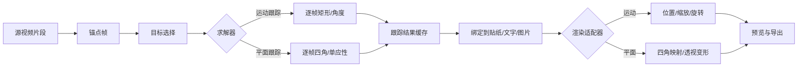

# 剪映运动跟踪与平面跟踪研究

> 研究日期：2026-08-30；11.3.0 模型与调用链补充：2026-08-31
>
> 实测版本：剪映专业版 macOS 11.3.0（`com.lemon.lvpro`）
>
> 研究范围：贴纸、图片或文字素材右侧属性面板中的“跟踪”，不是“摄像机跟踪”、AI 运镜、自动重构图或蒙版人物跟踪。

## 1. 结论先行

剪映这里的“运动跟踪”和“平面跟踪”不是同一个算法换了两个 UI 名字。它们共享任务调度、时间方向、结果缓存和素材绑定，但求解的数据、失败条件以及最终渲染方式都不同。

| 项目 | 运动跟踪 | 平面跟踪 |
| --- | --- | --- |
| 跟踪对象 | 人、车、球、物体局部等可框选目标 | 屏幕、墙面、桌面、招牌等近似刚性的平面区域 |
| 用户初始选择 | 一个矩形目标框 | 一个四点平面区域 |
| 主要逐帧结果 | 目标矩形：`left/top/right/bottom`，可带角度 | 平面四角：`p1..p4`，等价于逐帧透视关系 |
| 核心几何 | 中心位移、宽高变化，可能附带旋转 | 单应性矩阵（homography）或等价四边形 |
| 素材如何跟随 | 改变位置，按选项改变缩放/距离 | 做四角映射、透视变形，再叠加位置/缩放/旋转修正 |
| 擅长 | 跟着人物或物体移动的标签、贴纸、箭头 | 把图片/文字“贴”在会改变透视的屏幕、墙、地面上 |
| 天生限制 | 不能真实表达平面透视和四角独立变化 | 不适合软体、强形变、无纹理、重度遮挡或严重运动模糊 |

最简判断：

- 只需要“这个贴纸一直待在人物旁边”时，选运动跟踪。
- 需要“这张图真的像贴在屏幕或墙上”时，选平面跟踪。
- 平面跟踪不是更高级的万能运动跟踪；选错目标时，它会比矩形跟踪更容易失败。

## 2. 先把四个容易混淆的功能分开

### 2.1 本文的运动跟踪

这是贴纸/文字/图片素材的目标跟随功能。它从视频中框选一个目标，计算目标矩形随时间的位置和大小，再让另一个素材跟随。

### 2.2 本文的平面跟踪

这是贴纸/文字/图片素材的平面绑定功能。它跟踪一个四点平面，保留透视变化，再把素材映射到该平面。

### 2.3 摄像机跟踪或 AI 运镜

摄像机跟踪会让画面构图、平移或缩放围绕人物/脸/身体变化。它改变的是“镜头怎么看素材”，不等于把一个贴纸绑定到某个目标。

本机还存在 `js_cv_trackmotion*` 资源，其中可读逻辑涉及脸部框、镜头运动和平滑。这些更接近摄像机/智能运镜链路，不能拿来证明贴纸平面跟踪的实现。

### 2.4 QCut 当前的蒙版框跟随

QCut 当前把 MediaPipe、SAM3 或 optical-flow 产生的 `MediaMask` 逐帧外接框当作跟踪目标，再让贴纸跟随该框。这能覆盖一部分“运动跟踪”的视觉用途，但不是剪映原生单目标跟踪器，也完全不等于四点平面跟踪。

## 3. 两种跟踪共享的完整流水线



共享层应负责：

- 锚点帧和源媒体时间换算；
- 从时间轴向左、向右或双向的任务范围；
- 进度、取消、重试和缓存；
- 跟踪结果与消费素材之间的绑定；
- 修剪、变速、倒放、替换素材后的失效判断；
- 无效帧、丢失目标和恢复跟踪的状态表示。

不应该共享成一种数据的部分：

- 矩形与四边形不是同一种轨迹；
- 普通 transform 与 corner pin/perspective warp 不是同一种渲染；
- 运动跟踪的目标丢失判据与平面 homography 失效判据不同。

## 4. 运动跟踪到底在算什么

### 4.1 输入

用户在锚点帧框住目标。矩形通常写成：

```text
R0 = (left0, top0, right0, bottom0)
```

跟踪器随后在相邻帧寻找同一个目标，得到：

```text
Rt = (leftt, topt, rightt, bottomt, anglet?, statust)
```

本机模型和二进制证据显示，剪映存在独立的单目标跟踪链路，包括 `SINGLE_OBJECT_TRACKING`、初始化框、重置、平滑与惩罚参数，以及 `VEVideoTrackingAlgorithm`。这和后面的 `VESurfaceTrackingAlgorithm` 是两套类。

### 4.2 如何驱动贴纸

设矩形中心和尺寸为：

```text
Ct = center(Rt)
St = size(Rt)
```

最基本的绑定是把目标中心位移应用到贴纸：

```text
position(t) = anchorPosition + (Ct - C0)
```

如果启用缩放跟随，还会使用目标尺寸相对锚点尺寸的变化。实际产品通常还要保存贴纸相对目标中心的偏移，避免贴纸在开始跟踪后突然吸到框中心。

剪映草稿侧的静态类型还出现了：

- `enable_scale`
- `enable_relative_distance`
- `VideoTrackingConfig.center_x/center_y/width/height/rotation`

这些字段支持“位置跟随 + 可选缩放/相对距离”的解释，但字段到最终矩阵的精确组合仍需受控导出实验确认。

### 4.3 本机已有成功结果

在一个旧草稿的成功结果中观察到：

- `resType = 1`；
- 原始缓存尺寸为 `720 x 1280`；
- `track_boxes` 有 90 个 30 fps 的稠密矩形；
- 单个框以像素 `[x1, y1, x2, y2]` 保存；
- 处理后的 `data.json` 有 18 个较稀疏的 `left/top/right/bottom/angle/pts/status` 记录；
- 其中 17 个是正常矩形，另 1 个 `status = 4` 记录与 `baseline` 完全相同，不能按普通矩形解释；
- 该样例的 `angle` 为 0，不能据此断言算法永远不输出旋转；
- 观察到 `status = 1` 和 `status = 4`，但没有足够证据给这两个值命名。

`resType = 1` 只是在 11.3.0 样例中观察到的配置值，不应先写死成跨版本公共枚举。

### 4.4 运动跟踪的能力边界

矩形跟踪能表达：

- 平移；
- 目标外接框变大或变小；
- 某些实现中的整体角度。

单个矩形不能完整表达：

- 左右两边收缩程度不同；
- 梯形透视；
- 四个角分别移动；
- 图像真正贴合一个转向镜头的屏幕。

这就是平面跟踪必须拥有独立结果类型的原因。

### 4.5 贴纸运动跟踪的 11.3.0 调用路线

下面这条路线来自国内剪映专业版 `VideoFusion-macOS.app` 11.3.0，不是 CapCut。它是把 UI 文案、客户端接口、二进制符号、内嵌算法图和已生成旁车拼成的最短证据链，不是一条已经用运行时调用栈逐层抓到的 trace：

```text
贴纸属性面板 / 运动跟踪
  -> StickerClient::startVideoTrackingV3(...)             editor IPC 客户端
  -> 编辑器服务端的范围、方向、进度与取消调度
  -> VEInfoStickerPinControlImpl / VEVideoTrackingAlgorithm
  -> TEVideoTrackingUnit / TEBachSmartObjectTrackingAlgorithm
  -> 内嵌 Bach graph: static_object_tracking
  -> node: object_tracking_0
  -> object_tracking/bingo_objectTracking_v1.0.dat
  -> Bach ObjectTracking buffer / 逐帧目标框
  -> videoTracking 旁车 cache.json / data.json
  -> SwingObjectTracker / Pin control 插值
  -> 贴纸 position / scale / rotation
  -> 预览与导出
```

各段证据边界：

| 路线段 | 证据 | 当前判断 |
| --- | --- | --- |
| UI 到 `StickerClient::startVideoTrackingV3` | 同产品 UI 文案与专用导出接口 | 静态强证据；尚缺一次点击时的调用栈 |
| `StickerClient` 到编辑器服务端 | 反汇编显示请求被打包后交给 `lyra::Server::invokeAsync/invokeSync` | 已确认它是 IPC 包装层，不是求解器 |
| Sticker Pin 到 Bingo tracker | `INFO_STICKER_PIN`、`beginPin`、`setPinSelectedArea` 与 Bingo 模型路径相邻；内嵌图明确引用该模型 | 静态强证据 |
| 求解器到矩形轨迹 | `getAlgoResult`、bbox/status/score、丢失与左右插值路径 | 静态强证据 |
| 轨迹到旁车 | 旧成功草稿含 90 个稠密框和 18 个处理后记录 | 运行生成实证 |
| 旁车到贴纸 TRS | `getTrackingBaseLineTRS` 及 position/scale/rotation 消费符号 | 静态强证据 |

这里最重要的修正是：`StickerClient` 只负责跨进程发起任务，真正的视觉跟踪实现主要落在 `libcccreator.dylib` 的 Bach/VE 路径中。只调用 `startVideoTrackingV3` 而不复现剪映编辑器服务端环境，不会自然得到一个可独立使用的 tracker。

### 4.6 两套单目标模型不能混成一条路线

11.3.0 同时带有两套可见的单目标跟踪资源：

| 资源 | 大小 | SHA-256 | 能确认的用途 |
| --- | ---: | --- | --- |
| `models/object_tracking/bingo_objectTracking_v1.0.dat` | 163,884 B | `b2f10c3c1ccc68afb7f5f61c587a29de029b8eff9590755f3b554db4aa04834f` | `static_object_tracking` 图中的 `object_tracking_0`；当前贴纸 Pin 路线的最强候选 |
| `models/single_object_tracking_v1.0.model` | 627,511 B | `7951eba5af0daa1f78e3962073b938169171d102107ed1585a5c6851adf3aab2` | `custom_lockon` / `custom_region` 规则中的 `SINGLE_OBJECT_TRACKING` |

用户缓存中的 `single_object_tracking_v1.0_size0_md5d0b0e377347d69bacef2473f5bae4799.model` 与安装包内第二个文件具有完全相同的 SHA-256，证明它是该版本模型的精确缓存副本。

另一条规则驱动路线是：

```text
rule_adjust_mask/algorithm_custom_lockon.json
  -> custom_lockon / custom_region 脚本
  -> internal algorithm type 188: SINGLE_OBJECT_TRACKING
  -> single_object_tracking_v1.0.model
  -> track bbox + score
```

`algorithm_custom_lockon.json` 提供 `initial_bbox`、`object_tracking_model_name = single_object_tracking`、`enable_region_track` 和 reset 配置；缓存脚本还设置平滑与 penalty。它证明剪映还有一个自定义区域/锁定目标的单目标跟踪器，但不足以证明截图中的贴纸运动跟踪使用这一个模型。当前针对 Sticker Pin 的直接静态证据更偏向 Bingo 路线。

### 4.7 能把模型识别到什么程度

`single_object_tracking_v1.0.model` 内可见 `backbone`、`kernel_convs`、`search_convs`、`anchors` 和 `windows`。这与模板/kernel 分支加搜索分支的 Siamese/RPN 类跟踪器一致，但不能据此给它贴上某个公开论文模型的确切名字。

Bingo 路线周围可见 `bboxPredLayerNames`、`clsScoreLayerNames`、`centernessLayerNames`、NMS、阈值、重检测、角度/尺度搜索和网格参数。它明显不是文档中独立探针所用的 CSRT/KCF/MOSSE，但现有证据仍不能断言它就是 SiamCAR、SiamFC++ 或其他具体公开架构，也无法确认训练数据。

因此当前可靠表述是：

- 剪映 11.3.0 不是只用一个“运动跟踪模型”；
- 贴纸 Pin 路线强指向 Bingo 单目标跟踪运行时；
- 自定义区域/锁定路线使用另一份 Siamese/RPN 类模型；
- 精确网络拓扑、公开模型身份和训练数据仍未决。

### 4.8 二进制归属与版本指纹

本次检查固定到以下 arm64 版本，后续本地桥接不能只按文件名猜兼容性：

| 文件 | arm64 UUID | SHA-256 | 角色 |
| --- | --- | --- | --- |
| `libcccreator.dylib` | `100726E3-FCB0-31BC-98EE-1B196A1714A3` | `b09c395d934169cb20ec865dd1d4032ca68023b287a7264e1b06ff4d71fd1be4` | Bach/VE 算法、Pin 控制、轨迹消费 |
| `libvideoeditor.dylib` | `22337058-B217-3CAF-9979-CFECA7302CF7` | `ee33e4e68ecf3dc05501d04c4415a3a52ce60c6a6ed3615330963e78be4c25ab` | 编辑器 schema、服务与 IPC 客户端 |

`libcccreator.dylib` 还保留 `BachAlgorithmObjectTracking.cpp`、`BachObjectTrackingBuffer.cpp`、`Bingo_ObjectTracking_createHandle`、`ObjectTracker` 和 `TrackingState.cpp` 等归属线索。相反，名字很像视觉算法的 `libTracking.dylib` 实际导出 `startTracking`、`postTrackingEvent`、`TrackingUploadNew` 和 `table_tracking_event` 等埋点上传能力；它是遥测库，不是目标跟踪求解器。

本次没有取得“点击开始跟踪时打开哪个模型文件”的特权文件访问 trace，因此不能把静态强证据写成运行时模型打开实证。这个缺口不影响旁车已经由剪映真实生成的结论，但会影响最小依赖闭包的最终裁剪。

## 5. 平面跟踪到底在算什么

### 5.1 输入是一个“可追踪平面”，不是一个物体框

用户在锚点帧提供四个角点。剪映 11.3.0 的成功样例按图像坐标系（`y` 向下）观察到的顺序是：

```text
p1 = 左上
p2 = 左下
p3 = 右下
p4 = 右上
```

四个点形成有方向的闭合四边形，不能在保存或传输时随意重新排序，否则会出现翻面、扭曲或自交。

### 5.2 求解目标是逐帧透视关系

平面上锚点帧的点 `x0` 到第 `t` 帧的点 `xt` 可用 3x3 单应性矩阵表示：

```text
xt ~ Ht * x0
```

`~` 表示齐次坐标下相差一个尺度。求解器通常从平面内部提取特征、匹配或跟踪这些特征，用 RANSAC 排除外点，再估计 `Ht`。至少需要四组正确且不共线的对应点。

剪映二进制中的强静态证据包括：

- `VESurfaceTrackingAlgorithm` 与 `VEVideoTrackingAlgorithm` 分离；
- `nail_slam::planar::PlanarTracker`；
- `HomographyEstimatorCallback`、`HomographyRefineCallback`；
- `findHomography`、homography inliers 和 invalid 分支；
- Surface Tracking Controller 接收四个 `Vector2f` 点；
- 渲染控制器可读取平面点和外接框，并更新 host transform。

因此，“四点轨迹 + homography + 透视消费”属于静态强证据，不只是根据 UI 图标作出的猜测。

OpenCV 的官方文档也给出了同一类标准实现：特征匹配后用 RANSAC `findHomography`，再用 `perspectiveTransform` 映射四角。[OpenCV Features2D + Homography](https://docs.opencv.org/4.x/d7/dff/tutorial_feature_homography.html)

### 5.3 结果如何作用到素材

平面跟踪不能只把四边形缩成中心点。渲染至少要完成：

1. 从锚点四边形建立局部平面坐标；
2. 把消费素材放入该局部平面；
3. 每帧用 `Ht` 或目标四边形做 corner pin/perspective warp；
4. 再应用用户的全局位置、缩放、旋转或角度修正；
5. 对关键帧修正做插值，但不能破坏跟踪基础数据。

剪映 UI 在成功后提供“素材角度调节”，分成“全局调节”和“关键帧调节”。静态符号中也存在四角编辑、全局移动和二次编辑配置。这说明修正层位于跟踪结果之上，不等于重新求解视频特征。

### 5.4 受控成功实验

实验素材由我们生成，不使用剪映私有资源：

- `720 x 1280`；
- 30 fps；
- 3 秒；
- 高对比度棋盘格、彩色标记和随时间变化的透视；
- 在 `t = 1.5s` 选择平面；
- UI 选择“双向跟踪”。

运行结果：

- 剪映显示处理完成；
- “全局调节”和“关键帧调节”被启用；
- 在开头、锚点和末尾抽查时，贴纸保持在中央平面区域；
- `desc.json` 中观察到 `resType = 4`、`startTime = 1500000`、`endTime = 2966667`；
- `data.json` 保存 `p_x1..p_x4`、`p_y1..p_y4`、`pts` 和 `status`；
- 锚点四边形是归一化的 `0.35..0.65` 方形；
- 后续四角产生不同幅度的位移，能够表达梯形和透视，不只是中心/尺寸变化；
- 45 个样例全部是非零有效几何，`status` 均为 0。

这里出现一个重要未决点：UI 明确列出“双向跟踪 / 从时间轴向右跟踪 / 从时间轴向左跟踪”，但该旁车文件只含从 `1.5s` 到片尾的 45 个时间戳。锚点前结果究竟写在加密草稿字段、以另一种时间基准消费，还是 11.3.0 存在保存层缺口，目前不能靠这一个样例下结论。实现 QCut 时不要照抄这个可疑范围语义，应先定义自己的明确时间合同。

## 6. 失败样例揭示的关键规则

用户截图对应的 3 秒真人运动模糊素材产生了一个“任务完成但结果无效”的平面跟踪旁车：

- `resType = 4`；
- 保存后的 `desc` 范围为 `0..2.958333s`；
- `data.json` 共 72 个记录；
- 只有 `0.875s` 和 `0.916667s` 两个记录保留 `0.35..0.65` 的初始四边形；
- 其余 70 个记录的四个角全部写成 0；
- 所有记录的 `status` 仍然是 0。

二进制中的错误分支明确把以下情况写成当前帧全零结果：

- ROI 路径失败；
- ROI 结果无效；
- 跟踪目标丢失；
- 无效平面结果在消费端被忽略。

因此必须遵守：

```text
status == 0 不能推出结果有效
```

成功样例和失败样例的 `status` 都是 0。有效性至少还要检查：

- 四点是否为有限数；
- 四点是否全零或接近全零；
- 四边形面积是否大于阈值；
- 是否自交；
- 边长和面积相对前一帧是否发生不合理跳变；
- homography 是否可逆、条件数是否可接受；
- RANSAC 内点数和内点比例是否过低；
- 重投影误差是否过高。

UI 的失败提示与算法条件一致：平面缺少明显纹理、平面包含动态元素、被遮挡或出现严重模糊时，应重新选择平面。

## 7. “跟踪方向”是时间方向

剪映 11.3.0 的下拉菜单实测为：

- 双向跟踪；
- 从时间轴向右跟踪；
- 从时间轴向左跟踪。

这不是“只跟横向 / 纵向位移”，而是从当前时间轴锚点向未来、过去或两边传播。CapCut 官方公开说明同样把运动跟踪方向描述为 forward、backward 或 both，但这里只把它当作同厂产品的公开交互语义参照，不用于证明国内剪映的内部实现。[CapCut Motion Tracking](https://www.capcut.com/resource/motion-tracking-after-effects)

正确的数据合同应明确区分：

```text
timelineTime   时间轴上的合成时间
clipLocalTime  片段内部时间
sourceTime     原媒体时间
frameIndex     求解器使用的离散帧号
```

剪辑发生 trim、speed、reverse、freeze 或 replace 后，这四个量不再是简单相等关系。UI 中出现“修改后跟踪效果丢失，需要重新跟踪”以及变速/分割限制，是合理的所有权约束，不只是产品限制文案。

## 8. 草稿与运行时的所有权

静态类型显示，剪映把跟踪放在时间线材料集合 `materials.video_trackings` 中。相关对象大致分为：

### 8.1 跟踪材料

`MaterialVideoTracking` 可见字段包括：

- `result_path`
- `map_path`
- `config`
- `enable_video_tracking`
- `version`
- `tracker_type`
- `enable_scale`
- `enable_relative_distance`
- `tracking_time_range`
- `trackers`
- `tracker_data_id`

### 8.2 跟踪器绑定

`VideoTracker` 可见字段包括：

- `target_segment_id`
- `src_segment_id`
- `surface_id`
- `data_path`
- `type`
- `surface_second_edit_config`
- `second_edit_media_time`

这说明至少存在三个不同所有者：

1. 视频片段提供图像和媒体时间；
2. 跟踪材料拥有算法结果文件和配置；
3. 贴纸/文字/图片片段通过 target/source/surface 标识消费结果。

同一个平面跟踪 UI 可以管理多个命名平面，`surface_id` 很可能是平面选择和消费绑定的关键，但多平面成功草稿仍需单独实验。

## 9. 互斥、编辑与失效规则

从 UI 文案和运行时类型可整理出以下产品规则：

- 同一消费素材上的运动跟踪和平面跟踪互斥；应用一种会移除另一种。
- 平面跟踪接管素材的透视/形变，不能再让另一个独立形变系统同时拥有四角。
- 平面跟踪完成后，可在画布上做全局修正或关键帧修正。
- 重新选择平面、重新跟踪或切换跟踪模式可能丢弃已有修正。
- 分割、修剪、变速、倒放、替换源素材等操作必须触发重映射或失效。
- 跟踪结果应绑定源片段身份与源时间范围，不能只绑定一个可复用 URL。
- 无效帧必须显式存在；不能把零四边形当作合法画面中心。

## 10. QCut 当前实现到了哪里

当前本地代码快照中的相关文件：

- `apps/web/src/lib/stickers/sticker-tracking.ts`
- `apps/web/src/lib/stickers/sticker-tracking-export.ts`
- `apps/web/src/components/editor/properties-panel/sticker-tracking-properties.tsx`
- `apps/web/src/lib/stickers/__tests__/sticker-tracking.test.ts`
- `apps/web/src/lib/stickers/__tests__/sticker-tracking-export.test.ts`
- `packages/editor-core/src/types/timeline.ts`
- `packages/editor-core/src/jianying-draft/sticker-validation.ts`

当前行为：

- 贴纸可绑定一个 ready 的 tracked `MediaMask`；
- 支持来源为 MediaPipe、SAM3 或 optical-flow 的 mask track；
- 锚点保存目标中心/尺寸；
- 每帧根据外接框中心差更新 `x/y`；
- `followScale` 可根据面积比例更新宽高；
- 现有 mask 轨迹不提供可靠旋转，因此不跟随旋转；
- 导出把逐帧 `x/y` 和可选 `width/height` 烘焙为样例；
- 平面跟踪 UI 当前明确显示无可用 homography/surface solver。

这个现状是合理的第一阶段，但命名上要保持诚实：它是“基于 mask 外接框的运动跟随”，不是已经实现了剪映平面跟踪。

## 11. QCut 推荐数据模型

不要继续把平面数据塞进 `MediaMask` 矩形。建议把任务、结果和绑定拆开：

```ts
type TrackingDirection = "backward" | "forward" | "both";

type TrackingTime = {
  frameIndex: number;
  sourceTimeUs: number;
};

type TrackValidity =
  | { valid: true; confidence?: number }
  | {
      valid: false;
      reason:
        | "insufficient-features"
        | "lost"
        | "occluded"
        | "invalid-geometry"
        | "out-of-range";
    };

type MotionTrackSample = TrackingTime & {
  kind: "motion";
  rect: { left: number; top: number; right: number; bottom: number };
  rotationRad?: number;
  validity: TrackValidity;
};

type PlanarTrackSample = TrackingTime & {
  kind: "planar";
  corners: readonly [
    { x: number; y: number },
    { x: number; y: number },
    { x: number; y: number },
    { x: number; y: number },
  ];
  homography?: readonly [
    number, number, number,
    number, number, number,
    number, number, number,
  ];
  inlierRatio?: number;
  reprojectionError?: number;
  validity: TrackValidity;
};

type TrackingJob = {
  id: string;
  sourceElementId: string;
  anchorFrameIndex: number;
  direction: TrackingDirection;
  startFrameIndex: number;
  endFrameIndex: number;
  solver: "mask-bbox" | "single-object" | "planar-homography";
};

type TrackingBinding = {
  consumerElementId: string;
  trackId: string;
  anchorFrameIndex: number;
  followPosition: boolean;
  followScale: boolean;
  followRotation: boolean;
  planarCorrectionTrackId?: string;
};
```

设计要点：

- `kind` 使用判别联合，避免在运行时猜字段。
- corner order 写进 schema，并在入口校验 winding 和自交。
- 时间保存 `sourceTimeUs + frameIndex`，不要只存浮点秒。
- 原始 solver result 与用户 correction 分层，重新求解时才有机会保留修正。
- 无效结果保存原因，渲染器必须显式决定 hold、interpolate、hide 或 fail。
- 跟踪任务、跟踪数据、素材绑定分别拥有稳定 ID。

## 12. 推荐求解与渲染架构

### 12.1 Shared orchestration

- 建立 anchor frame；
- 展开 forward/backward/both 帧序列；
- 解码帧并保持准确 source PTS；
- 发送进度和可取消信号；
- 批量落盘结果；
- 维护结果版本和输入指纹；
- 发现源片段改变时失效。

### 12.2 Motion solver adapter

第一阶段可继续把现有 mask bbox 转成 `MotionTrackSample`。之后再接成熟的 single-object tracker，补齐旋转、置信度和 lost/reacquire 语义。

### 12.3 Planar solver adapter

不要手写 homography 数值求解。推荐基于成熟实现：

1. 在锚点 ROI 内检测 ORB/AKAZE 或 Shi-Tomasi 特征；
2. 用 descriptor matching 或 pyramidal KLT 跟踪；
3. 前后向误差筛选；
4. RANSAC `findHomography`；
5. 检查内点比例、重投影误差、矩阵条件数和四边形几何；
6. 必要时定期回到锚点特征重定位，减少逐帧漂移；
7. 输出四角和质量指标。

实现载体可评估 Electron 原生 worker、已有媒体 worker 或 OpenCV WASM。无论选哪种，solver 不能堵住渲染线程。

### 12.4 Render adapters

运动跟踪：

- 读取矩形中心、尺寸和可选旋转；
- 结合锚点偏移生成普通 2D transform；
- 对短缺口可插值，对长缺口按策略 hold/hide/fail。

平面跟踪：

- 从四角或 homography 生成 perspective transform；
- 用 corner pin/mesh 或 GPU 投影矩阵渲染；
- 在跟踪矩阵之上应用用户 correction；
- 预览与导出必须使用同一矩阵组合函数。

## 13. 测试与验收矩阵

### 13.1 数据单元测试

- 四点顺序、winding、自交和面积校验；
- 全零、NaN、Infinity、退化四边形拒绝；
- rect 和 quad 的归一化/像素转换；
- homography 与四角互相转换；
- source time、clip local time、timeline time 换算；
- forward/backward/both 帧序列无遗漏、无重复；
- invalid gap 的 hold/interpolate/hide 策略；
- schema version migration。

### 13.2 合成视频测试

- 纯平移；
- 等比与非等比缩放；
- 面内旋转；
- 透视收缩和梯形变化；
- 部分遮挡后恢复；
- 重度运动模糊；
- 低纹理白墙；
- 重复纹理；
- 非刚性布料/人脸；
- 平面出画再入画。

合成测试必须有已知 ground truth，按角点误差、重投影误差和有效帧率验收，不能只看“任务成功”。

### 13.3 编辑行为测试

- 锚点在开头、中间和末尾；
- 向左、向右、双向；
- trim 前后；
- 0.5x、2x、倒放、定格；
- 替换媒体；
- 裁剪和画布比例变化；
- 同一源上的多个平面；
- 重新跟踪后 correction 保留策略；
- 运动和平面模式互斥。

### 13.4 渲染与导出测试

- 预览与导出逐帧矩阵一致；
- 开头、锚点、末尾像素对比；
- 无效帧不会把素材压到 `(0, 0)`；
- 长视频不产生无界样例数组；
- 取消或崩溃不会留下可被误读为 ready 的半成品；
- 导出失败应指出具体 track/frame/reason。

## 14. 证据等级与未决问题

| 结论 | 等级 | 说明 |
| --- | --- | --- |
| 运动跟踪与平面跟踪使用不同算法类 | 静态强证据 | 独立 video/surface algorithm、object/planar tracker 符号 |
| 贴纸 Pin 路线使用 Bingo object tracker | 静态强证据 | 内嵌 `static_object_tracking` 图、模型路径及相邻 Pin 符号相互印证 |
| `single_object_tracking` 是另一条 custom lock-on/region 路线 | 静态强证据 | 规则、脚本、算法 type 188 和模型名闭环 |
| `StickerClient` 本身就是求解器 | 已证伪 | 反汇编显示它通过 Lyra IPC 发起编辑器服务请求 |
| `libTracking.dylib` 是视觉跟踪库 | 已证伪 | 导出与字符串均指向埋点、数据库和上传 |
| Bingo 与 single-object 模型的确切公开架构 | 未决 | 只能识别结构家族线索，不能可靠命名具体论文模型 |
| 点击“开始跟踪”时实际打开的模型文件 | 未决 | 尚无成功的特权文件访问 trace |
| 平面跟踪使用 homography 和四点结果 | 运行实证 + 静态强证据 | 成功旁车四点随帧变化；二进制存在 homography/inlier/refine 链路 |
| 成功平面四点顺序为 TL、BL、BR、TR | 运行实证 | 11.3.0 受控样例锚点确认 |
| 全零四点表示无效结果 | 运行实证 + 静态强证据 | 模糊真人样例 + zero-result 错误分支 |
| `status = 0` 表示成功 | 已证伪 | 成功和失败样例都为 0 |
| `resType 1/4` 分别对应运动/平面 | 版本内观察 | 尚未证明跨版本稳定 |
| 运动跟踪 status 1/4 的准确含义 | 未决 | 需要受控失败/恢复样例 |
| 双向跟踪的锚点前数据如何保存 | 未决 | UI 与当前旁车时间范围不完全一致 |
| 多平面的完整草稿结构 | 未决 | 需要同一视频创建两个平面的受控样例 |
| 跟踪矩阵与 correction 的精确乘法顺序 | 未决 | 需要已知四角 + 导出像素反算 |
| speed/reverse 后能否无损重映射 | 未决 | UI 倾向失效或限制，需逐项实测 |

## 15. 建议的实现顺序

1. 先固化统一任务/时间/有效性模型，把现有 mask bbox 适配成 `MotionTrackSample`。
2. 给运动跟踪补齐方向、失效、取消、缓存指纹和预览/导出共用解析器。
3. 新增独立 `PlanarTrackSample`，先用合成素材完成 OpenCV homography POC。
4. 接入 GPU perspective/corner-pin 渲染，并保证预览与导出共用矩阵组合。
5. 增加全局 correction，再增加关键帧 correction。
6. 最后做多平面、目标恢复、长片缓存和剪映草稿互操作。

不要从“把四个点塞进现有 mask 对象”开始。那会让 solver、数据、渲染和导出同时背上错误抽象，后续很难拆开。

## 16. 外部公开资料

下面的 CapCut 页面只用于补充同厂产品公开的交互概念。本文关于模型、二进制和调用链的结论全部来自国内剪映专业版 `com.lemon.lvpro` 11.3.0，不把 CapCut 安装包或网页当作实现证据。

- [CapCut 官方：Motion Tracking](https://www.capcut.com/tools/motion-tracking)
- [CapCut 官方：桌面端运动跟踪方向与 Scale/Distance](https://www.capcut.com/resource/motion-tracking-after-effects)
- [CapCut 官方：AI Movement 与对象运动跟踪的区别](https://www.capcut.com/tools/ai-movement-tracking)
- [OpenCV 官方：Features2D + Homography](https://docs.opencv.org/4.x/d7/dff/tutorial_feature_homography.html)
- [OpenCV 官方：Homography 基础与透视变换](https://docs.opencv.org/4.10.0/d9/dab/tutorial_homography.html)

## 17. 资料边界

本文只记录结构化结论、字段形状、实验统计和可公开复现的算法知识。没有收录或分发剪映二进制、模型、反编译源码、原始字符串转储、私有缓存素材或用户草稿。受控视频由本地 FFmpeg 生成，并通过剪映 UI 在隔离实验草稿中运行；生成的跟踪旁车只做只读检查。

后续允许在本机建立仅供研究的私有 runtime 备份，但必须位于 Git 仓库之外，禁止提交、上传、打包发布或成为 QCut 面向用户的强依赖。QCut 最终实现应是原创代码；私有 runtime 只作为本机 oracle 和迁移期对照。

## 18. 本地私有运行时与自研迁移路线

### 18.1 结论

路线可行，并且前两个阶段已经完成：

1. 已固定剪映专业版 11.3.0 的私有 runtime、动态库依赖闭包和两份跟踪模型；
2. 已恢复 `libcccreator.dylib` 导出的 `Bingo_ObjectTracking_*` 低层调用合同，能在剪映全部进程退出后，从普通视频和初始矩形产出双向逐帧轨迹；
3. QCut 自研 tracker 与产品接入仍是下一阶段，不能把私有 Bingo oracle 当作可发布实现。

因此现在得到的是“脱离剪映进程可调用”，不是“脱离剪映二进制可调用”。缓存的二进制和模型只能留在本机仓库外，用于研究与回归对照；QCut 不能分发它们，也不能把它们作为用户功能的运行时依赖。

### 18.2 阶段 A：缓存精确版本，不缓存一个孤立模型

已建立的仓库外目录：

```text
~/Library/Application Support/QCut/PrivateRuntimes/JianyingTracking/
  11.3.0-100726E3-FCB0-31BC-98EE-1B196A1714A3-b09c395d9341/
    Frameworks/
    Resources/models/
    manifest.json
  current -> 11.3.0-...
```

当前快照包含 23 个动态库和 2 个模型，共 `294,090,115` 字节。`libcccreator.dylib` 的 arm64 UUID 为 `100726E3-FCB0-31BC-98EE-1B196A1714A3`，SHA-256 为 `b09c395d934169cb20ec865dd1d4032ca68023b287a7264e1b06ff4d71fd1be4`。`manifest.json` 记录：

- 剪映版本和 bundle id；
- 架构、核心 Mach-O UUID、每个文件的字节数和 SHA-256；
- 模型相对路径、字节数和 SHA-256；
- 动态库依赖闭包；
- `localOnly: true` 与 `cloudUpload: false`；
- 生成时间和用途标识。

缓存脚本先在 staging 目录复制，再复算所有文件的字节数和 SHA-256，收紧权限后原子发布，并维护 `current` 符号链接：

```bash
bun research/jianying-tracking-probe/cache-private-runtime.ts
bun research/jianying-tracking-probe/cache-private-runtime.ts --verify-only
```

私有文件始终位于 Application Support；仓库只保存缓存工具、桥接源码、合同测试和不含私有内容的文档。

### 18.3 阶段 B：脱离剪映进程的调用桥

静态分析和运行探针确认，这个版本不需要从 `StickerClient`、`TEBachObjectTrackingAlgorithm` 或编辑器 IPC 进入。`libcccreator.dylib` 直接导出以下低层自由函数入口；它们具有简单的 C 形状参数，但符号仍使用 C++ name mangling：

```text
Bingo_ObjectTracking_getDefaultParam
Bingo_ObjectTracking_createHandle
Bingo_ObjectTracking_init
Bingo_ObjectTracking_setInitialBBox
Bingo_ObjectTracking_trackFrame
Bingo_ObjectTracking_releaseHandle
```

独立 C++ 子进程只在内部持有供应商 handle。TypeScript CLI 与它之间使用自有、与供应商 ABI 隔离的合同：

```text
input:
  videoPath | decodedFrameStream
  anchorFrameIndex
  initialRectNormalized
  direction: forward | backward | both

output:
  frameIndex, sourceTimeUs
  rectNormalized
  rotationDegrees, rawRotationCentidegrees
  status, rawStatus
```

普通视频调用入口：

```bash
bun research/jianying-tracking-probe/track-motion.ts \
  --video /path/to/input.mp4 \
  --rect 0.30,0.25,0.62,0.70 \
  --anchor-frame 45 \
  --direction both
```

默认结果原子写到 `/path/to/input.jianying-motion-track.json`。CLI 和桥接进程已经具备：

- manifest 全文件 hash、核心库 arm64 UUID 和模型 hash 不匹配即拒绝启动；
- 私有 C++ 对象和崩溃都隔离在子进程；
- 默认检测剪映主进程、helper 和 `lvve-service`，发现任一进程仍在运行即拒绝执行；
- 原生求解器在 macOS `sandbox-exec` 的 `deny network*` 策略中运行；
- 输入使用普通视频或解码帧，输出使用自有 JSON/二进制 schema；
- 不向 TypeScript 暴露私有 C++ 对象、指针或 mangled symbol；
- `forward`、`backward` 各自从锚点建立 session，`both` 按帧号无重复合并；
- 原始角度以百分之一度表示并在 `36000` 回绕，输出同时保留原值和普通角度。

验收在剪映进程数运行前后都为 `0` 的条件下生成 60 帧已知运动视频，从第 30 帧向前、向后跟踪并独立运行两次。11.3.0 的结果为：

- tracked `60/60`；
- 两次逐帧 sample 数组完全相同；
- 平均 IoU `0.940269`，最低单帧 IoU `0.879379`；
- 平均中心误差 `1.6225 px`，最大中心误差 `3.4910 px`；
- 两次结果 SHA-256 都是 `80fbba4b0bab9934b8239a905fcda74f61a8992f56a8548dce59832d32250113`。

验收命令为 `bun research/jianying-tracking-probe/run-private-runtime-acceptance.ts`，证据写到仓库外的 `~/Library/Application Support/QCut/ResearchEvidence/JianyingTracking/<run-id>/`。这些数字证明固定版本和当前合成样例已经闭环，不证明复杂真人、遮挡、运动模糊、其他剪映版本或最终贴纸插值层的 parity。

当前 `sourceTimeUs` 由帧号和平均 FPS 计算，所以可靠合同暂时只覆盖恒定帧率视频。VFR 输入需要增加逐帧 PTS sidecar 后才能进入 parity corpus。

### 18.4 阶段 C：替换为 QCut 自研实现

这一阶段尚未完成。私有桥与自研 tracker 应实现同一个 `MotionSolverAdapter`，这样 UI、任务调度、缓存和贴纸渲染不依赖具体求解器。迁移顺序建议为：

1. 先固定矩形、时间、方向、validity 和 lost/reacquire 合同；
2. 选成熟开源 tracker 做可运行基线，不从零手写数值核心；
3. 用合成 ground truth、剪映旁车和私有 oracle 建 golden corpus；
4. 分别比较中心误差、IoU、有效帧率、漂移、遮挡恢复和耗时；
5. 达到阈值后让 QCut 自研实现成为默认，私有 oracle 留在本地研究测试中；
6. 最终移除产品运行时对剪映文件、ABI 和安装状态的依赖。

平面跟踪继续走独立的 `surface_tracker` / homography 路线。不要因为两者共享任务 UI，就让 Bingo 矩形 tracker 承担四角透视问题。

## 19. 独立探针

同目录提供三组探针：

- `tracking-probe-core.mjs`：可嵌入 Node/QCut worker 的纯数据分析层；
- `tracking-probe-planar.mjs` / `tracking-probe-motion.mjs`：独立的四角与矩形审计模块；
- `tracking-probe-shared.mjs`：共用数值、状态和问题模型；
- `tracking-probe.mjs`：可直接传 bundle、单个 JSON 或归档根目录；
- `tracking-probe.test.mjs`：只使用合成数据的回归测试；
- `probe_motion_video.py`：直接从普通视频运行 CSRT/KCF/MOSSE 矩形跟踪；
- `probe_planar_video.py`：直接从普通视频运行 LK 光流 + RANSAC homography 四角跟踪；
- `video_probe_common.py`：独立视频、时间、坐标和结果写出公共层；
- `test_video_probes.py`：使用已知透视 ground truth 的视频回归测试；
- `cache-private-runtime.ts`：建立并校验仓库外的版本锁定私有 runtime；
- `bingo-tracking-bridge.cpp`：直接调用 `Bingo_ObjectTracking_*` 的隔离原生桥；
- `track-motion.ts`：普通视频、FFmpeg 解码、进程与网络隔离及结果发布入口；
- `track-motion.test.ts`：不依赖私有 runtime 的 CLI 合同测试；
- `run-private-runtime-acceptance.ts`：脱离剪映的确定性与 ground truth 验收；
- `PROBES.zh-CN.md`：完整调用方式和退出码。

Node 旁车层零第三方依赖；Python 视频层只依赖 NumPy 和 OpenCV contrib。这两组是 QCut 可拥有和分发的透明实现，不要求剪映运行或安装，也不调用剪映二进制。第三组是本机私有 Bingo oracle：不要求剪映进程、账号、草稿或网络，但明确依赖仓库外缓存的 11.3.0 私有二进制和模型，不能打包或发布。

当前验证结果：Node 10 项测试通过，Python 8 项测试通过，Bingo CLI 合同 16 项测试通过；在 90 帧受控校准视频上，独立运动和平面探针均得到 90/90 有效样例，私有 Bingo oracle 在 60 帧样例上得到 60/60 tracked 且两次结果完全一致。这些结果分别证明透明参考实现和私有 oracle 都可独立调用，不代表二者已经达到逐帧 parity。
